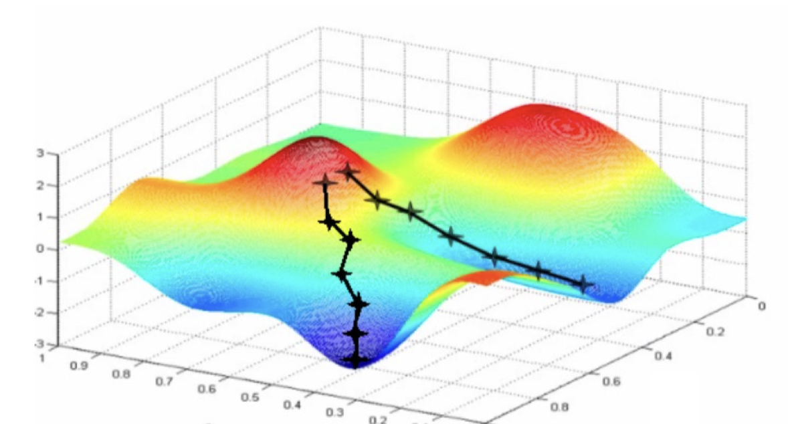
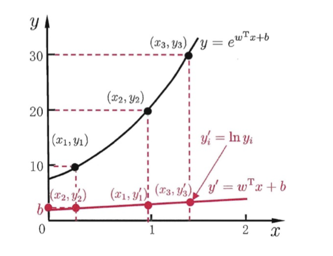

# 机器学习介绍与线性模型

  by <a href="https://github.com/zhuozhiyongde">Arthals</a> / GPT4 / Claude 3 Opus
   
  blog: <a href="https://arthals.ink">Arthals' ink</a>

## 机器学习

机器学习，指通过算法的设计与分析，使得：

-   模型的 **表现** 得到提升
-   在某些 **任务** 上
-   基于 **经验**

### 机器学习的任务

1. **有监督学习**：这种方式需要提前给模型提供 “正确答案”，让模型在学习过程中有明确的参照。比如：

    - **分类问题**：判断输入数据属于哪个类别，例如判断一封邮件是不是垃圾邮件。
    - **回归问题**：预测一个连续值，例如预测房屋的价格。

2. **无监督学习**：模型在没有 “正确答案” 的情况下自我学习，它会尝试理解数据的结构。

    - **聚类**：将数据分组，组内相似度高，组间相似度低，例如将顾客分为不同的群体。
    - **密度估计**：估计数据生成的概率分布，例如在数据中找出异常点。
    - **降维**：减少数据的复杂性，同时保留重要特征，例如用于数据可视化。

3. **半监督学习**：结合了有监督和无监督学习，使用大量未标记数据和少量标记数据进行学习。

4. **弱监督学习**：标记数据不完全、不确切或不可靠，但仍旨在通过这些不完美的标记来进行学习。

5. **强化学习**：模型通过与环境的交互来学习，它试图找出在给定情况下的最佳动作，以最大化所获得的奖励。

### 机器学习的经验

训练数据 vs 测试数据

一个好的机器学习算法

-   不会过拟合 (overfit)
-   训练数据可以泛化（generalize）到测试数据

### 机器学习的表现

表现的衡量方法：从一个随机测试数据 $X$，衡量真实标签 $Y$ 和预测 $f(X)$ 之间的接近程度

#### 二元分类（Binary Classification）

二元分类是一个简单的分类问题，只有两个类别的结果。损失函数为 0/1 损失，即如果预测正确，损失为 0；预测错误，损失为 1。

**二元分类的 0/1 损失函数**

$$
\text{loss}(Y, f(X)) = 1\{f(X) \neq Y\}
$$

其中，$1\{\}$ 是指示函数，当 $f(X)$（预测值）不等于 $Y$（真实值）时，结果为 1，表示有损失；否则结果为 0，表示没有损失。

#### 回归（Regression）

在回归任务中，我们预测 **连续的输出值**。损失函数为平方损失，即预测值与真实值之差的平方。

**回归的平方损失函数**

$$
\text{loss}(Y, f(X)) = (f(X) - Y)^2
$$

这里 $(f(X) - Y)^2$ 表示预测值 $f(X)$ 与实际值 $Y$ 之间差的平方。这个值越小，表示预测越准确。

#### 密度估计（Density Estimation）

密度估计是 **估计输入数据概率分布** 的任务。损失函数为负对数似然损失，这里衡量的是模型对真实分布的拟合程度。

**密度估计的负对数似然损失函数**

$$
\text{loss}(f(X)) = -\log(P_f(X))
$$

其中，$P_f(X)$ 是模型预测的数据点 $X$ 的概率。负对数似然损失函数衡量的是模型对数据生成概率的估计与实际分布的拟合程度。这个值越小，表示模型的估计越接近真实分布。

#### 机器学习的理想目标

机器学习的目标是找到一个预测规则 $f$，它可以最小化损失函数的期望值。这里提到最小化的是联合分布 $P_{XY}$​ 下的损失期望，实际中我们通常通过样本数据来近似这个期望。

## 线性模型

线性模型：线性模型就是要学习特征 $X$ 的一种线性组合来进行预测，进行运算 $y = wX + b$，其中 $w$ 是 $X$ 的权重，$b$ 是偏置，$y$ 是预测值。我们希望通过学习得到最优的 $w$ 和 $b$，使得预测值 $y$ 与真实值 $y_{GT}$ 的误差最小。

其中，$X$ 具有 $n$ 个特征，$X = (x_1, x_2, ..., x_n)$，其每个分量都代表一个特征，$y = w_1x_1 + w_2x_2 + ... + w_nx_n + b$，是 $X$ 各个特征的线性组合。

线性回归：给定数据 $D = \{(x_1, y_1), (x_2, y_2), \ldots, (x_n, y_n)\}$, 用一个线性模型估计最接近真实 (y) (ground truth) 的连续标量: $f(x_i)=w^T \cdot x_i + b$， 也就是要 $f(x_i) \approx y_i$

$(w, b)$ 是要学习的模型参数.

也就是要：

$$
f^{*} = \arg \min_f \mathbb{E} [ ( f ( X )-Y )^{2} ]
$$

由于我们不能无限地获得数据，所以我们只能通过有限的数据来估计这个期望，也就是：

$$
f^{*}= \arg \min_f \frac{1}{N} \sum_{i=1}^{N} ( f ( x_i )-y_i )^{2}
$$

这也被称为 Empirical mean（经验均值）。

其中，$n$ 是数据的数量，$x_i$ 是第 $i$ 个数据的全部特征，$y_i$ 是第 $i$ 个数据的真实值，$f(x_i)$ 是第 $i$ 个数据的预测值。

根据大数定理，当数据量足够大时，经验均值会趋近于期望，也就是：

$$
\frac{1}{n} \sum_{i=1}^{n} loss ( x_{i}, y_{i} ) \overset{n \to\infty} {\longrightarrow} \mathbb{E}_{X, Y} [ loss ( X, Y ) ]
$$

我们可以通过最小二乘法来获取最优的 $w$ 和 $b$。

我们选择以线性代数来表示这个问题，也就是 Least Squares Estimator（最小二乘估计）：

$$
\begin{aligned}
(w^{*}, b^{*}) &= \arg \min \sum_{i=1}^{n} ( f ( x_{i} )-y_{i} )^{2} \\
&= \arg \min \sum_{i=1}^{n} ( y_{i}-w x_{i}-b )^{2}
\end{aligned}
$$

我们将之转为矩阵形式：

$$
\mathbf{A}=\left[\begin{matrix}{X_{1}}\\{\vdots}\\{X_{n}}\\\end{matrix}\right]=\left[\begin{matrix}{X_{1}^{(1)}}&{\dots}&{X_{1}^{(p)}}\\{\vdots}&{\ddots}&{\vdots}\\{X_{n}^{(1)}}&{\dots}&{X_{n}^{(p)}}\\\end{matrix}\right],\quad Y=\left[\begin{array}{c}{y_{1}}\\{\vdots}\\{y_{n}}\end{array}\right],\quad \beta=\left[\begin{array}{c}{w_{1}}\\{\vdots}\\{w_{p}}\end{array}\right]
$$

注意这一步的 $\mathbf{A}$ 的每一行代表一个数据 $X_i$，每一行除了最后一列，都是 $X_i$ 的特征，最后一列是 $1$，这是一个小的 trick，因为这样做的话，我们就可以把 $b$ 合并到 $\beta$ 中，也就是：

$$
\mathbf{A}=\left[\begin{matrix}{X_{1}^{(1)}}&{\dots}&{X_{1}^{(p-1)}}&{1}\\{\vdots}&{\ddots}&{\vdots}&{\vdots}\\{X_{n}^{(1)}}&{\dots}&{X_{n}^{(p-1)}}&{1}\\\end{matrix}\right],\quad \beta=\left[\begin{array}{c}{w_{1}}\\{\vdots}\\{w_{p-1}}\\{b}\end{array}\right]
$$

我们可以得到：

$$
\begin{aligned}
\hat{\beta} &= \arg\min_{\beta} \frac{1} {n} \sum_{i=1}^{n} ( X_{i} \beta-Y_{i} )^{2} \\
&= \arg\min_{\beta} \frac{1} {n} ( \mathbf{A} \beta-\mathbf{Y} )^{\mathrm{T}} ( \mathbf{A} \beta-\mathbf{Y} )
\end{aligned}
$$

其中，$\hat{\beta}$ 是最优的 $w$，也就是我们要求的结果。

简化这个式子，去掉和优化无关的 $\frac{1}{n}$ ，我们可以得到：

$$
\begin{aligned}
J(\beta) &= ( \mathbf{A} \beta-\mathbf{Y} )^{\mathrm{T}} ( \mathbf{A} \beta-\mathbf{Y} ) \\
&= \beta^{\mathrm{T}} \mathbf{A}^{\mathrm{T}} \mathbf{A} \beta- \beta^{\mathrm{T}} \mathbf{A}^{\mathrm{T}} \mathbf{Y}- \mathbf{Y}^{\mathrm{T}} \mathbf{A} \beta+ \mathbf{Y}^{\mathrm{T}} \mathbf{Y}\\
&= \beta^{\mathrm{T}} \mathbf{A}^{\mathrm{T}} \mathbf{A} \beta-2 \beta^{\mathrm{T}} \mathbf{A}^{\mathrm{T}} \mathbf{Y}+\mathbf{Y}^{\mathrm{T}} \mathbf{Y}\\
\quad \frac{\partial J(\beta)}{\partial \beta} &= 2 \mathbf{A}^{\mathrm{T}} \mathbf{A} \beta-2 \mathbf{A}^{\mathrm{T}} \mathbf{Y} = 0 \\
\end{aligned}
$$

这里第三个等号利用了中间两项互为转置且均为标量的性质合并了他们。第四个等号则应用了矩阵求导的性质。

如果 $\mathbf{A}$ 可逆，那自然可以根据上式求出 $\beta$ 的解：

$$
\hat{\beta}=( \mathbf{A}^{\mathrm{T}} \mathbf{A} )^{-1} \mathbf{A}^{\mathrm{T}} \mathbf{Y}
$$

但是，很多情况下，$\mathbf{A}$ 并不可逆，比如 $n < p$ 时，我们可以证明它一定不可逆。而且即使 $\mathbf{A}$ 可逆（此时要求样本个数 $n$ 要大于等于待估参数量 $p$，包含截距项），当它的维度很大时，计算也是很昂贵的。

所以，我们可以通过梯度下降法来求解最优的 $\beta$。

梯度下降法的思想是：从随机选取的 $\beta$ 开始，每次沿着梯度的反方向走一步（走的多长由学习率 Learning Rate 决定），直到收敛。只要这个损失函数是凸函数，我们总能优化到最优点。

## 贝叶斯统计

$$
\begin{aligned}
&\max_{\beta}p(D|\beta)p(\beta)=\max_{\beta}\log p(D|\beta)+\log p(\beta)\\\\
&\hat{\beta}_{\mathrm{MAP}}=\arg\max_{\beta}\underbrace{\log p\left(\{(X_i,Y_i)\}_{i=1}^n\mid\beta,\sigma^2\right)}_{\log\text{likelihood}} + \underbrace { \log p \left ( \beta \right )}_{\log\text{prior}}
\end{aligned}
$$

第一行的含义是，我们要最大化数据的似然函数和参数的先验概率的乘积。

-   似然函数表示数据（$D$）在给定参数 $\beta$ 的情况下出现的概率
-   先验概率表示我们在看到数据之前对参数的信念。

最大化这个乘积等价于最大化它们的对数，因为对数是单调递增的函数。

第二行的第一个项代表的含义是，在给定参数 $\beta$ 和方差 $\sigma^2$ 的情况下，数据出现的概率。

> 在统计模型中：
>
> -   $\beta$ 通常代表模型的系数
> -   $\sigma^2$ 代表模型中的噪声或误差的方差。即使我们有了 $\beta$，我们还需要知道数据中的变异性（或不确定性）有多大，这就是为什么 $\sigma^2$ 是重要的。
>
> 在某些模型，比如线性回归中，我们假设数据 $Y$ 是由自变量 $X$ 的线性组合（由 $\beta$ 确定）加上一些随机噪声（由 $\sigma^2$ 描述）生成的。这个噪声代表了除了 $X$ 影响 $Y$ 之外的其它因素。所以，$\sigma^2$ 帮助我们了解除了主要效应（由 $\beta$​ 描述）之外，数据中还有多少随机波动。

我们采取高斯先验，也即假设参数遵循高斯分布（也称为正态分布）。那么也就有 $\beta \sim N(0, \tau^2I)$。

这表示：

-   参数 $\beta$ 是一个 N 维向量，其中 N 是特征的数量
-   其遵循均值为 0，方差为 $\tau^2$ 的多元高斯分布
-   $\tau^2I$ 是指协方差矩阵为 $\tau^2$ 的对角矩阵，这代表 $\beta$ 的每个元素都是相互独立的，且每个元素的方差都是 $\tau^2$。
-   也就是说，各个维度独立同分布（iid）。

$\beta$ 的概率密度分布函数按照矩阵表示，则是：

$$
p(\beta) = \frac{1}{(2\pi)^{n/2}|\Sigma|^{1/2}} e^{-\frac{1}{2}(\beta - \mu)^T \Sigma^{-1} (\beta - \mu)}
$$

> 可以比较一维版本来理解～
>
> 其中的 $| \Sigma |$ 是协方差矩阵的行列式，它的作用是保证概率密度函数的总面积为 1。而当它为对角矩阵时，还能额外保证各个维度彼此独立。

所以，我们有 $p(\beta) \propto e^{-\beta^T\beta/2\tau^2}$​。

这不包括归一化常数。$\propto$ 表示成比例，意味着这是未归一化的概率密度，它的形状随着 $\beta$ 的变化而变化，但是总面积（概率总和）是固定的。$\beta^T\beta$ 是 $\beta$ 的二次项，表示参数向量的长度的平方。

关于这一部分，可以阅读 [钱默吟/多元高斯分布完全解析](https://zhuanlan.zhihu.com/p/58987388)，讲的很详细。

这个式子的一个直观理解，就是假设 $\beta$ 是一个二维的，那么我们可以可视化这个分布：

那么在这个图中，任意一个点都代表一个高斯分布，而 $f(x_1,x_2)$ 就是这个点的概率密度。我们可以看到，这个分布是关于原点对称的，这也是 $p(\beta)$ 中的 $\beta^T\beta$ 的作用，这代表了我们对于变量的顺序是没有偏好的。

带入进行复杂的数学推导 [^1] 后，我们就可以得到：

$$
\hat{\beta}_{\mathbf{MAP}}=\arg\min\sum_{i=1}^n(Y_i-X_i\beta)^2+\lambda\parallel\beta\parallel_2^2
$$

为什么刚才是 $\arg \max$，现在又变成了 $\arg \min$？简单说明就是，刚才我们要最大化从已知的 $\beta$ 中得到数据真实分布的概率，这就等价于最小化使用我们的模型，从 $X$ 中得到的数据的误差（也即最大似然估计）。

而 $\lambda$ 是一个超参数，它的作用是控制我们对于参数的偏好，也就是我们对于模型的复杂度的偏好。在后续的学习中，我们会知道 $\lambda\parallel\beta\parallel_2^2$ 其实是一个正则项，它的作用是防止过拟合。

当我们对于 $\beta$ 的先验假设不一样时，这个惩罚项（正则项）也会不一样。但大致原理不变，于是我们对这个形式加以推广，得到了类似如下的公式：

$$
\min_\beta(\mathbf{A}\beta-\mathbf{Y})^T(\mathbf{A}\beta-\mathbf{Y})+\lambda\mathrm{pen}(\beta)=\min J(\beta)+\lambda\mathrm{pen}(\beta)
$$

其中，$J(\beta)$ 是我们的损失函数，$\mathrm{pen}(\beta)$ 是惩罚项。

对于惩罚项，我们一般有两个选择：

-   L1 正则（1 - 范数）：$\mathrm{pen}(\beta)=\parallel\beta\parallel_1=\sum_{i=1}^n|\beta_i|$
-   L2 正则（2 - 范数）：$\mathrm{pen}(\beta)=\parallel\beta\parallel_2^2=\sum_{i=1}^n\beta_i^2$​

这两个惩罚项的解，具有如下特征：

-   **L1 岭回归的正则化项**：$\lambda \sum_{j=1}^{p} \beta_j^2$，这是一个 L2 范数，它对大的系数施加更大的惩罚，导致系数平滑地趋近于零。**有些 $w$ 更小**。
-   **L2 套索回归的正则化项**：$\lambda \sum_{j=1}^{p} |\beta_j|$，这是一个 L1 范数，它对所有系数施加相同的惩罚，这会导致一些系数直接为零，从而产生一个稀疏解。**非零 $w$​ 更少**。

简而言之：**岭回归无法剔除变量，套索回归的优良性质是能产生稀疏性，可以将一些不重要的回归系数缩减为 0，达到剔除变量的目的。** [^2]

最终，我们得到广义的线性模型，我们可以考虑任意一种单调可微的函数 $g(.)$：

$$
y=g^{-1}(w^Tx+b)
$$

其中，$g(.)$ 是激活函数，它的作用是将线性模型的输出转换为我们想要的输出，也即将线性模型的输出转换为一个非线性的预测值。比如，当 $g(.)$ 是恒等函数时，我们就得到了线性回归；当 $g(.)$​ 是 sigmoid 函数时，我们就得到了逻辑回归。

在这个图中，$g$ 就是 $\log$ 函数，而对应的 $g^{-1}$ 就是 $e^x$ 指数函数。通过这个变换，我们将一个线性的 $y'= (w^Tx+b)$ 变换得到了非线性的 $y$。

## Reference

[^1]: [L1，L2 正则化的理解](https://hellojialee.github.io/2020/01/28/L1%E5%92%8CL2%E6%AD%A3%E5%88%99%E5%8C%96%E7%9A%84%E7%90%86%E8%A7%A3/)
[^2]: [SlimSRecovery / 线性回归模型估计](https://zhuanlan.zhihu.com/p/194447481)

关于最大化高斯分布的后验概率等价于最小化二阶范数的具体推导，还有一个由 GPT4 生成的推导过程：

> 在高斯分布下，假设权重 $w$ 遵循均值为 0，方差为 $\sigma^2$ 的正态分布，即 $w \sim \mathcal{N}(0, \sigma^2)$。那么权重的概率密度函数（PDF）为：
>
> $$
> P(w) = \frac{1}{\sqrt{2\pi\sigma^2}}\exp\left(-\frac{w^2}{2\sigma^2}\right)
> $$
>
> 取对数得到：
>
> $$
> \log P(w) = \log\left(\frac{1}{\sqrt{2\pi\sigma^2}}\right) - \frac{w^2}{2\sigma^2}
> $$
>
> 因为第一项 $\log\left(\frac{1}{\sqrt{2\pi\sigma^2}}\right)$ 是常数，对于优化问题，我们只考虑影响模型参数 $w$ 的项，所以可以忽略它。因此，我们只关注第二项：
>
> $$
> -\frac{w^2}{2\sigma^2}
> $$
>
> 在机器学习中，我们通常使用代价函数（或损失函数）来训练模型。假设我们的代价函数为 $J(w)$，为了使 $w$ 接近于高斯分布，我们可以在代价函数中增加对数先验 $\log P(w)$，即：
>
> $$
> J'(w) = J(w) - \lambda \log P(w)
> $$
>
> 其中 $\lambda$ 是正则化参数。将 $\log P(w)$ 代入上式得到：
>
> $$
> J'(w) = J(w) + \lambda \frac{w^2}{2\sigma^2}
> $$
>
> 我们可以看到这里的 $\lambda \frac{1}{2\sigma^2}$ 起到了正则化系数的作用。这个正则化项是 $w$ 的平方，即 $L2$ 正则项。通常我们将 $L2$ 正则化系数表示为 $\alpha = \lambda \frac{1}{2\sigma^2}$，所以代价函数可以写为：
>
> $$
> J'(w) = J(w) + \alpha w^2
> $$
>
> 这显示了在高斯分布下 $\log P(w)$ 的效果等价于在代价函数中增加 $L2$​ 正则项。这种正则化有时也被称为权重衰减，它鼓励模型学习更小的权重，从而可以提高模型的泛化能力，防止过拟合。
