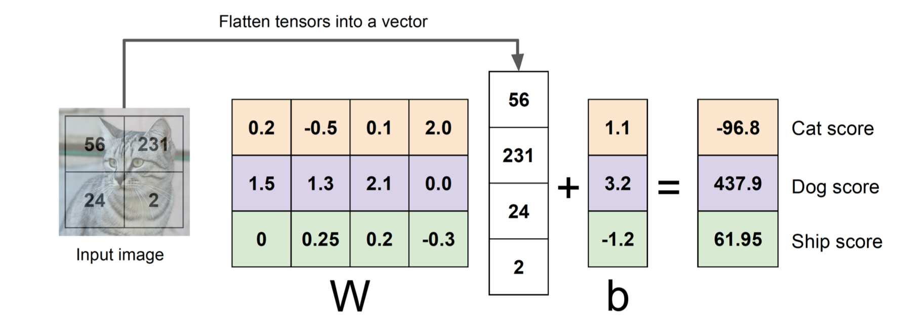

# 机器学习中的线性回归与分类问题

  by <a href="https://github.com/zhuozhiyongde">Arthals</a> / GPT4 / Claude 3 Opus
   
  blog: <a href="https://arthals.ink">Arthals' ink</a>

## 机器学习

机器学习：指通过算法的设计与分析使得我们能够 **基于经验** 提升模型在某些任务上的表现

三要素：任务、经验、表现

-   线性回归（Linear Regression）：连续预测
-   线性分类（Linear Classification）：离散预测，线性决策边界

## 逻辑回归（Logistic Regression）

**用于分类而非回归**。输出 “属于一个分类” 的概率。

逻辑回归是 **有参方法**。它的参数在于线性组合里的各个特征的权重 / 偏置部分。

1. Unit-step function（单位阶跃函数）：这是一个简单的分法，当 $z<0$ 时，$y=0$；当 $z=0$ 时，$y=0.5$；当 $z>0$ 时，$y=1$。
2. Logistic function（逻辑函数或 Sigmoid 函数）：它是单位阶跃函数的平滑版本，用来代替单位阶跃函数。逻辑函数的公式是 $y = \frac{1}{1 + e^{-z}}$，其中 $e$ 是自然对数的底数，$z$ 通常是特征与权重的线性组合。这个函数将 $z$ 映射到一个 $(0,1)$ 区间内的值，表示概率。

Sigmoid 函数通常定义为：

$$
\sigma(x) = \frac{1}{1 + e^{-x}}
$$

为了推导它的导数，我们首先对其进行变形。

$$
\begin{aligned}
(1 + e^{-x})*\sigma(x) &= 1\\
e^{-x}*(-1)*\sigma(x) + \sigma'(x)*(1 + e^{-x}) &=0\\
\sigma'(x)*(1 + e^{-x}) &= e^{-x}*\sigma(x)\\
\sigma'(x)&=(1-\sigma(x))*\sigma(x)
\end{aligned}
$$

最终，我们得到了 Sigmoid 函数的导数：

$$
\sigma'(x) = (1-\sigma(x))\sigma(x)
$$

在这个式子中，唯一的变量是 $x$，而对于神经网络，我们可以将指数改写为输入的权重和特征的线性组合。

$$
\begin{aligned}y=\frac{1}{1+e^{-(w^Tx+b)}}\end{aligned}
$$

这里得到的 $y$ 是一个概率值，表示输入 $x$ 属于正类的概率。我们可以将这个概率值与阈值进行比较，以决定输入 $x$ 属于哪一类。

进一步，我们可以得到 $x$ 是正类的 **相对概率**：

$$
\frac{y}{1-y}
$$

让我们把这个线性组合加上 Sigmoid 函数组合起来，得到逻辑回归的表达式，其可以用来估计，在给定的模型参数 $w$ 和 $b$ 下，给定输入为 $x$ 时，网络输出 $C_1$ （即将之归类为 $C_1$）的后验概率：

$$
\begin{aligned}P_{w,b}(C_1|x)=\frac{1}{1+e^{-(w^Tx+b)}}\end{aligned}
$$

接下来，考虑伯努利分布（二分类）的特殊情况。

对于伯努利分布，我们有：

| 事件     | 概率  |
| -------- | ----- |
| $P(Y=1)$ | $p$   |
| $P(Y=0)$ | $1-p$ |

所以，对于给定的真实分布 $P(Y|X)$，我们可以得到似然函数：

$$
\begin{aligned}P(Y|X)=p^y(1-p)^{1-y}\end{aligned}
$$

> 这里的 $y$ 是 $Y$ 的实际观察值（要么是 1，要么是 0）。
>
> -   如果 $Y=1$，似然函数就变成了 $p$
> -   如果 $Y=0$，似然函数就变成了 $1-p$

将其中的 $p$ 替换为逻辑回归的输出 $f_{w,b}(x)$，我们得到了逻辑回归的似然函数：

$$
\begin{aligned}P(Y|X)=L(w,b)=\prod_{i=1}^Nf_{w,b}(x^i)^{y^i}(1-f_{w,b}(x^i))^{1-y^i}\end{aligned}
$$

其中，$N$ 是样本的数量，$x^i$ 是第 $i$ 个样本的输入，$y^i$ 是第 $i$ 个样本的真实类别，$f_{w,b}(x^i)$ 是逻辑回归的输出。

> 这里巧妙的运用了当幂指数为 0 时，结果为 1 的性质。我们之所以写成上标，是因为后文下标我们要用于表示某个样本的某个特征。

我们可以对之进行取负对数的操作，得到负对数似然函数（损失函数）：

$$
\begin{aligned}-\ln L(w,b)=-\sum_{i=1}^N(y^i\log f_{w,b}(x^i)+(1-y^i)\log(1-f_{w,b}(x^i)))\end{aligned}
$$

这个函数就是逻辑回归的损失函数，我们可以通过最小化这个函数来得到最优的模型参数 $w$ 和 $b$。

接下来，定义一个非常重要的概念：**熵 (Entropy)**。

熵：服从某一特定概率分布事件的理论最小平均编码长度。

已知一个离散变量 $i$ 的概率分布 $P(i)$，我们有熵的公式：

$$
Entropy =-\sum_{n=1}^nP(i)\log_2P(i)
$$

而对于连续变量，我们有：

$$
Entropy =-\int P(x)\log_2P(x)dx
$$

我们可以将之统一为：

$$
H(P)=Entropy=\mathbb{E}_{x\sim P}[-\log P(x)]
$$

为什么说熵是理论最小平均编码长度呢？观察上述式子，我们可以发现，如果我们想让他最小，那么当 $P(i)$ 越大，$-\log_2P(i)$ 就要越小，也就是说，当某个事件发生的概率越大，我们对其编码的长度越短。这就是熵的含义。

举个生活中的例子，就是一个发生概率越大的事件，他往往没有什么有效的信息，如 “太阳东升西落”，所以我们对其编码的长度越短，而发生概率越小的事件，他往往包含了更多的信息，如 “明天会下雨”，所以我们对其编码的长度就会越长。

接下来，我们定义 **交叉熵 (Cross Entropy)**。

交叉熵：用来 **衡量两个概率分布之间的差异** 的。

假设现在有一个样本集中两个概率分布 $p,q$，其中 $p$ 为真实分布。真实分布的熵为：

$$
H(p) = \sum_i p(i) \cdot \log\left(\frac{1}{p(i)}\right)
$$

如果采用错误的分布 $q$ 来表示来自真实分布 $p$ 的样本，则平均编码长度应该是：

$$
H(p,q) = \sum_i p(i) \cdot \log\left(\frac{1}{q(i)}\right)
$$

可以证明，$H(p,q) \geq H(p)$，当且仅当 $p=q$ 时，等号成立。

关于交叉熵，有几个重要的性质：

-   交叉熵是非负的
-   交叉熵等于 **真实分布的熵加上 KL 散度**
-   交叉熵是不对称的

其中，KL 散度也是用来衡量两个概率分布之间的差异的，它的定义如下：

$$
D_{KL}(p||q) = \sum_i p(i) \cdot \log\left(\frac{p(i)}{q(i)}\right)
$$

将之前提到的，伯努利分布的似然函数带入交叉熵的定义，我们可以立即注意到，逻辑回归的损失函数就是交叉熵。

接下来，我们就要考虑优化逻辑回归的损失函数了。

在之前的学习中，我们知道我们需要通过梯度下降法来优化损失函数。而计算梯度的过程，我们可以使用链式法则来进行，需要算出损失函数对于模型参数的偏导数。

在此做推导如下：

$$
\begin{align*}
-\frac{\partial \ln L(w,b)}{\partial w_i} &= \sum_n -\left[ y^n \frac{\partial \ln f_{w,b}(x^n)}{\partial w_i} + (1 - y^n) \frac{\partial \ln (1 - f_{w,b}(x^n))}{\partial w_i} \right] \\
&= \sum_n -\left[ y^n (1 - f_{w,b}(x^n)) x_i^n - (1 - y^n) f_{w,b}(x^n) x_i^n \right] \\
&= \sum_n -\left[ y^n - f_{w,b}(x^n) \right] x_i^n \\
&= \sum_n -(y^n - f_{w,b}(x^n)) x_i^n
\end{align*}
$$

其中的推导细节包括：

$$
\begin{align*}
\frac{\partial \ln f_{w,b}(x^n)}{\partial w_i}
&= \frac{1}{f_{w,b}(x^n)} \frac{\partial f_{w,b}(x^n)}{\partial w_i} \\
&= \frac{1}{f_{w,b}(x^n)} f_{w,b}(x^n) (1 - f_{w,b}(x^n)) x_i^n \\
&= (1 - f_{w,b}(x^n)) x_i^n
\end{align*}
$$

对于第二项，类似可推。

观察这个最终的式子：

$$
\begin{aligned}
-\frac{\partial \ln L(w,b)}{\partial w_i} = \sum_n -(y^n - f_{w,b}(x^n)) x_i^n
\end{aligned}
$$

我们可以发现，当模型预测值 $f_{w,b}(x^n)$ 与真实值 $y^n$ 相差越大时，梯度的绝对值就越大，也就是说，**遇到预测错误的样本时，我们会对模型参数进行更大的调整**。

继续，下一步通过梯度下降法来优化损失函数，对于模型参数 $w_i$ 的更新公式为：

$$
\begin{aligned}
w_i = w_i - \eta \frac{\partial \ln L(w,b)}{\partial w_i} = w_i - \eta \sum_n -(y^n - f_{w,b}(x^n)) x_i^n
\end{aligned}
$$

其中，$\eta$​ 是学习率，用来控制每次更新的步长，通常取一个较小的值。

### 逻辑回归 vs 线性回归

### 逻辑回归的局限性

逻辑回归是一个线性分类器，它的决策边界是线性的（当 $w^Tx+b=0$ 时，$f_{w,b}(x)=0.5$，也就是说，$w^Tx+b=0$ 就是决策边界）。这意味着，如果数据的真实分布不是线性可分的（如异或 XOR），那么逻辑回归就无法很好的拟合这个数据。

### 级联的逻辑回归 DNN (Deep Neural Network)

## 线性分类器

线性分类器：**典型的有参方法**，通过学习到的参数来进行预测。

我们不能像排序数组一样硬编码一个算法来解决图像分类问题，因而我们通过机器学习，来找到一个函数 $f(x,W)$，其以输入 $x$ 和模型参数 $W$ 为输入，输出一个预测值 $y$。

可以看到，$W$ 由 $classes \times features$ 组成，$x$ 由 $features \times 1$ 组成，$b$ 由 $classes \times 1$ 组成。

对于 $W$ 中的每一行，都会与 $x$ 进行乘法，再加上 $b$ 中的对应元素，最后得到一个 $classes \times 1$ 的向量，其中的每个元素都代表了 $x$ 归类为此类的得分。

进一步的，我们就可以得到损失函数：

$$
L=\frac{1}{N}\sum_i L_i(f(x_i,W),y_i)
$$

其中，$L_i$ 是第 $i$ 个样本的损失函数，$N$ 是样本数量，$f(x_i,W)$ 是模型的输出，$y_i$ 是第 $i$ 个样本的真实类别。

对于线性分类器，我们通常使用交叉熵损失函数：

$$
L_i=-\log\left(\frac{e^{f_{y_i}}}{\sum_je^{f_j}}\right)
$$

其中：

-   $f_{y_i}$ 是 $f(x_i,W)$ 中的第 $y_i$ 个元素，代表真实分类所对应的得分
-   $f_j$ 是 $f(x_i,W)$ 中的第 $j$ 个元素
-   总和 $\sum_je^{f_j}$ 是所有分类的得分之和。

关于为什么会得到这个形式，我们做阐述如下：

首先，考虑矩阵乘法，我们得到的可能是个负值，而我们需要输出的是一个概率，所以我们可以通过指数函数来将之转换为正值。也即进行一次 $e^{f_{x_i,W}}$ 操作。

接着，我们还需要保证输出的概率和为 1，所以我们需要对输出的结果进行归一化。也即进行一次 $\frac{e^{f_{x_i,W}}}{\sum_je^{f_j}}$ 操作。

以上的操作，也被称为 **Softmax** 操作。

最后，我们运用之前所学过的交叉熵损失函数，其可以衡量我们的预测概率分布和真实概率分布之间的差异：

$$
\begin{aligned}
L_i&=-\log P(Y=y_i|X=x_i)\\
&=-\log\left(\frac{e^{f_{y_i}}}{\sum_je^{f_j}}\right)
\end{aligned}
$$

这在形式上，十分类似于 one-hot 编码的 KL 散度：

$$
D_{KL}(P||Q)=\sum_yP(y)\log\frac{P(y)}{Q(y)}\\
$$

整个过程的计算方式如下：

随后，我们就可以通过梯度下降法来优化损失函数了。而最优参数 $W^*$ 就是使得损失函数最小的参数，也就是我们的优化目标。

### 线性分类器的局限性

线性分类器是一个有参方法，和逻辑回归一样，**它的决策边界也是线性的**。这意味着，如果数据的真实分布不是线性可分的（如异或 XOR），那么线性分类器就无法很好的拟合这个数据。

尽管我们可以通过一些诸如坐标变换的方法来将非线性可分的数据变成线性可分的，但这样的方法往往会增加模型的复杂度。

## 最近邻分类器（Nearest Neighbor Classifier）

最近邻分类器：**无参方法（模型没有参数，但是有超参）**，通过计算样本之间的距离来进行预测。

其中，距离的计算方法可以选择：

-   L1（曼哈顿距离）：$d_1(I_1,I_2)=\sum_p|I_1^p-I_2^p|$
-   L2（欧氏距离）：$d_2(I_1,I_2)=\sqrt{\sum_p(I_1^p-I_2^p)^2}$

这个算法依赖于超参数（Hyperparameters）的选定：

-   k：选择多少个最近的个样本
-   距离的计算方法：L1 或 L2

虽然如此，它也有一个很严重的问题，就是它十分依赖于数据的分布。如果数据的分布不均匀，那么最近邻分类器的效果就会很差。

举个例子，当两张原本一模一样的图，其中一张被左右对称了，那么这两张图的距离就会变得很大，这样的话，最近邻分类器就会将这两张图归为不同的类别。

进一步的，我们思考如何设置超参数。

### 数据集的划分

我们将整个数据集，划分为训练集（Training Set）、测试集（Test Set）和验证集（Validation Set）：

-   训练集：用于训练模型，让模型从数据中学习到特征。训练集通常是整个数据集的大部分，比如 70%~80%。

-   验证集：用于在训练过程中评估模型的性能，并调整超参数。验证集通常占整个数据集的一小部分，比如 10%~15%。

-   测试集：模型训练完成后，在测试集上评估模型的最终性能。测试集通常占整个数据集的 10%~20%，必须是模型从未见过的数据。

当数据集较小的时候，我们还可以通过设置不同的折（Fold）来进行交叉验证（Cross Validation）：将整个数据集划分为 $k$ 个大小相同的子集，每次使用其中的 $k-1$ 个子集来训练模型，剩下的一个子集来验证模型。最后，将 $k$ 次的验证结果取平均值，作为最终的验证结果。

我们会选择平均结果最好的超参数。

### k - 近邻分类器（KNN）要点总结

- 在图片分类问题中，我们可以从一个图片和标签组成的训练数据集开始，预测测试图片的标签
- K - 近邻分类器根据最近的 K 个训练数据的标签，来预测测试数据的标签 Distance metric 和 K 是 **超参数**
- 可以在 **验证数据集（Validation set）** 上选择超参数
- **最后只在测试数据集上运行一次**

## 聚类

聚类：**无监督学习** 的一种，通过将数据集中的样本划分为若干个类别，使得同一类别的样本之间的相似度尽可能大（高类内相似度），不同类别的样本之间的相似度尽可能小（低类间相似度）。聚类具有 **主观性**。

常用的聚类算法：

-   分割算法
-   层级算法

### 分割算法（Parttion algorithms）

分割算法：把 $n$ 个对象分割成 $K$​ 个簇（Clusters），使得每个对象属于且仅属于一个组。

输入：一个对象集，数值 $K$

目标：最优化某个选定分割标准的 $K$ 组分割。

#### K-means 聚类

一种常用的聚类算法，旨在将数据集分成 K 个簇，使得同一个簇内的数据点之间距离尽可能小，而不同簇之间的数据点距离尽可能大。算法步骤如下：

1. 随机选择 K 个数据点作为初始簇中心。
2. 将每个数据点分配给最近的簇中心，形成 K 个簇。
3. 重新计算每个簇的中心，即每个簇内所有数据点的均值。
4. 重复步骤 2 和 3，直到簇中心不再变化或变化非常小。

问题：

1. **对于种子的选择敏感**，需要尝试不同的初始种子，且尽量让 $k$ 个初始种子互相远离。
2. **受离群值（Outliers）影响较大**。
