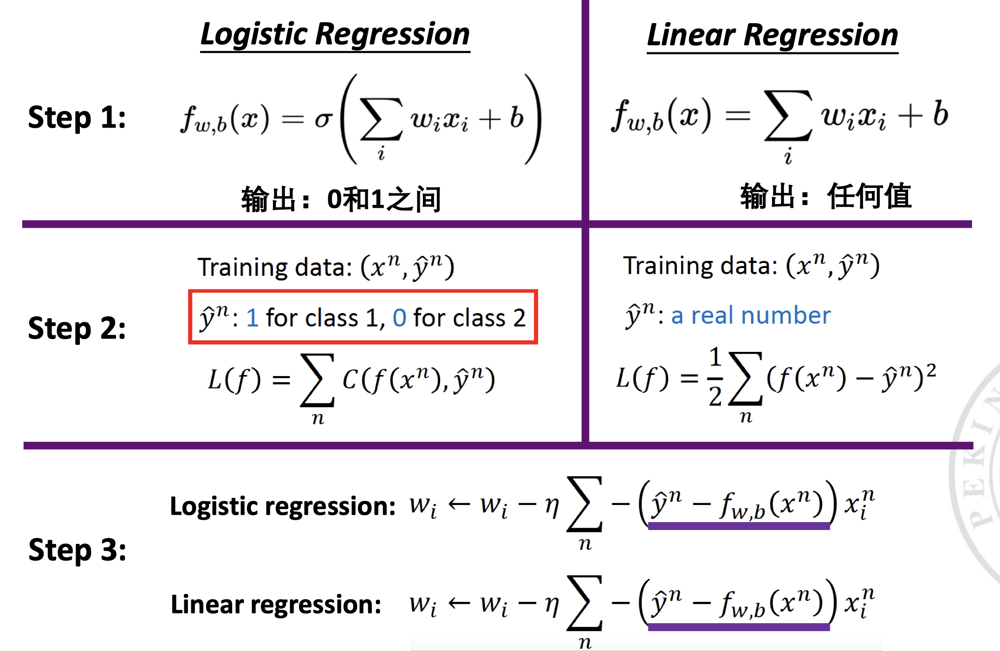
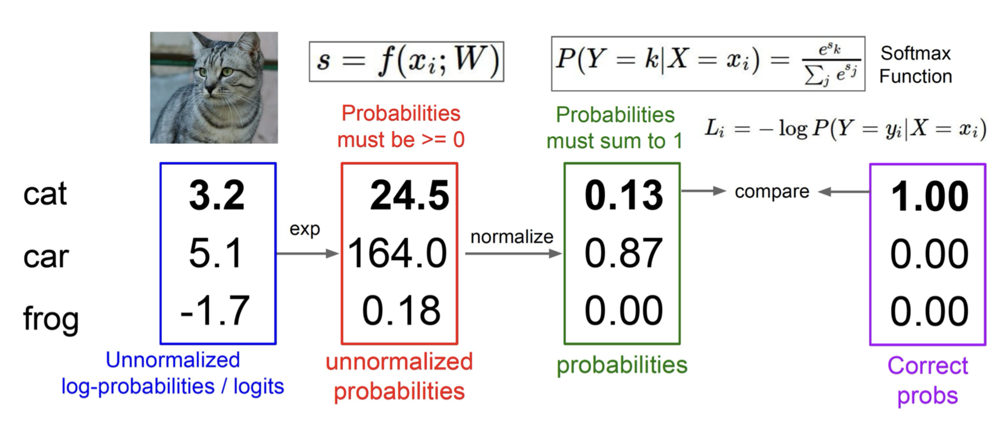

# 机器学习中的线性回归与分类问题

  by <a href="https://github.com/zhuozhiyongde">Arthals</a>
   
  blog: <a href="https://arthals.ink">Arthals' ink</a>

## 机器学习

机器学习：指通过算法的设计与分析使得我们能够 **基于经验** 提升模型在某些任务上的表现

三要素：**任务、经验、表现**

-   线性回归（Linear Regression）：连续预测
-   线性分类（Linear Classification）：离散预测，线性决策边界

## 逻辑回归（Logistic Regression）

**逻辑回归用于分类而非回归**。它输出的是 “属于一个分类” 的 **概率**。

逻辑回归是 **有参方法**，它的参数在于线性组合里的各个特征的权重 / 偏置部分。

1. Unit-step function（单位阶跃函数）：这是一个简单的分法，当 $z<0$ 时，$y=0$；当 $z=0$ 时，$y=0.5$；当 $z>0$ 时，$y=1$。
2. Logistic function（逻辑函数或 Sigmoid 函数）：它是单位阶跃函数的平滑版本，用来代替单位阶跃函数。逻辑函数的公式是 $y = \frac{1}{1 + e^{-z}}$，其中 $e$ 是自然对数的底数，$z$ 通常是特征与权重的线性组合。这个函数将 $z$ 映射到一个 $(0,1)$ 区间内的值，表示概率。

Sigmoid 函数通常定义为：

$$
\sigma(x) = \frac{1}{1 + e^{-x}}
$$

为了推导它的导数，我们首先对其进行变形。

$$
\begin{aligned}
(1 + e^{-x})·\sigma(x) &= 1\\
e^{-x}·(-1)·\sigma(x) + \sigma'(x)·(1 + e^{-x}) &=0\\
\sigma'(x)·(1 + e^{-x}) &= e^{-x}·\sigma(x)\\
\sigma'(x)&=(1-\sigma(x))·\sigma(x)
\end{aligned}
$$

最终，我们得到了 Sigmoid 函数的导数：

$$
\sigma'(x) = (1-\sigma(x))\sigma(x)
$$

在这个式子中，唯一的变量是 $x$，而对于神经网络，我们可以将指数改写为输入的权重和特征的线性组合：

$$
\begin{aligned}y=\frac{1}{1+e^{-(w^Tx+b)}}\end{aligned}
$$

这里得到的 $y$ 是一个概率值，表示输入 $x$ 属于正类的概率。我们可以 **将这个概率值与阈值进行比较**，以决定输入 $x$ 属于哪一类。

进一步，我们可以得到 $x$ 是正类的 **相对概率**：

$$
\frac{y}{1-y}
$$

让我们把这个线性组合加上 Sigmoid 函数组合起来，得到逻辑回归的表达式，其可以用来估计，在给定的模型参数 $w$ 和 $b$ 下，给定输入为 $x$ 时，网络输出 $C_1$ （即将之归类为 $C_1$）的后验概率：

$$
\begin{aligned}P_{w,b}(C_1|x)=\frac{1}{1+e^{-(w^Tx+b)}}\end{aligned}
$$

接下来，考虑伯努利分布（二分类）的特殊情况。

对于伯努利分布，我们有：

| 事件     | 概率  |
| -------- | ----- |
| $P(Y=1)$ | $p$   |
| $P(Y=0)$ | $1-p$ |

所以，对于给定的真实分布 $P(Y|X)$，我们可以得到似然函数：

$$
\begin{aligned}P(Y|X)=p^y(1-p)^{1-y}\end{aligned}
$$

> 这里的 $y$ 是 $Y$ 的实际观察值（也即真实标签，要么是 1，要么是 0）。
>
> -   如果 $Y=1$，似然函数就变成了 $p$
> -   如果 $Y=0$，似然函数就变成了 $1-p$

将其中的 $p$ 替换为逻辑回归的输出 $f_{w,b}(x)$，我们得到了逻辑回归的似然函数：

$$
\begin{aligned}P(Y|X)=L(w,b)=\prod_{i=1}^Nf_{w,b}(x^i)^{y^i}(1-f_{w,b}(x^i))^{1-y^i}\end{aligned}
$$

其中，$N$ 是样本的数量，$x^i$ 是第 $i$ 个样本的输入，$y^i$ 是第 $i$ 个样本的真实类别，$f_{w,b}(x^i)$ 是逻辑回归的输出。

> 这里巧妙的运用了当幂指数为 0 时，结果为 1 的性质。
>
> 我们之所以写成上标，是因为后文下标我们要用于表示某个样本的某个特征。

我们可以对之进行取负对数的操作，得到 **二分类的负对数似然函数（损失函数，也是交叉熵函数，见下文）**：

$$
\begin{aligned}-\ln L(w,b)=-\sum_{i=1}^N(y^i\log f_{w,b}(x^i)+(1-y^i)\log(1-f_{w,b}(x^i)))\end{aligned}
$$

其中：

-   $y^i$ 是第 $i$ 个样本的真实标签，取值为 0 或 1。
-   $f_{w,b}(x^i)$ 是模型对第 $i$ 个样本的预测概率（逻辑回归的输出）。
-   $N$​ 是样本总数。

这个损失函数在两个方面起作用：

1. 当真实标签 $y^i = 1$ 时，只考虑 $\log f_{w,b}(x^i)$ 项，鼓励模型预测的概率 $f_{w,b}(x^i)$ 趋向于 1。
2. 当真实标签 $y^i = 0$ 时，只考虑 $\log (1 - f_{w,b}(x^i))$ 项，鼓励模型预测的概率 $f_{w,b}(x^i)$ 趋向于 0。

这个函数就是逻辑回归的损失函数，我们可以通过最小化这个函数来得到最优的模型参数 $w$ 和 $b$​。

### 熵和交叉熵

接下来，定义一个非常重要的概念：**熵 (Entropy)**。

**熵**：服从某一特定概率分布事件的理论最小平均编码长度。

已知一个离散变量 $i$ 的概率分布 $P(i)$，我们有熵的公式：

$$
\text{Entropy} =-\sum_{n=1}^nP(i)\log_2P(i)
$$

而对于连续变量，我们有：

$$
\text{Entropy} =-\int P(x)\log_2P(x)dx
$$

我们可以将之统一为：

$$
H(P)=\text{Entropy}=\mathbb{E}_{x\sim P}[-\log P(x)]
$$

为什么说熵是理论最小平均编码长度呢？观察上述式子，我们可以发现，如果我们想让他最小，那么当 $P(i)$ 越大，$-\log_2P(i)$ 就要越小，也就是说，当某个事件发生的概率越大，我们对其编码的长度越短。这就是熵的含义。

举个生活中的例子，就是一个发生概率越大的事件，他往往没有什么有效的信息，如 “太阳东升西落”，所以我们对其编码的长度越短，而发生概率越小的事件，他往往包含了更多的信息，如 “明天会下雨”，所以我们对其编码的长度就会越长。

接下来，我们定义 **交叉熵 (Cross Entropy)**。

**交叉熵**：用来 **衡量两个概率分布之间的差异** 的。

假设现在有一个样本集中两个概率分布 $p,q$，其中 $p$ 为真实分布。真实分布的熵为：

$$
H(p) = \sum_i p(i) \cdot \log\left(\frac{1}{p(i)}\right)
$$

如果采用错误的分布 $q$ 来表示来自真实分布 $p$ 的样本，则平均编码长度应该是：

$$
H(p,q) = \sum_i p(i) \cdot \log\left(\frac{1}{q(i)}\right)
$$

可以证明，$H(p,q) \geq H(p)$，当且仅当 $p=q$ 时，等号成立。

关于交叉熵，有几个重要的性质：

-   交叉熵是非负的
-   交叉熵等于 **真实分布的熵加上 KL 散度**
-   交叉熵是不对称的

其中，KL 散度也是用来衡量两个概率分布之间的差异的，它的定义如下：

$$
D_{KL}(p||q) = \sum_i p(i) \cdot \log\left(\frac{p(i)}{q(i)}\right)
$$

将之前提到的，伯努利分布的似然函数带入交叉熵的定义，我们可以立即注意到，逻辑回归的损失函数就是交叉熵。

### 优化损失函数

接下来，我们就要考虑优化逻辑回归的损失函数了。

在之前的学习中，我们知道我们需要通过梯度下降法来优化损失函数。而计算梯度的过程，我们可以使用链式法则来进行，需要算出损失函数对于模型参数的偏导数。

在此做推导如下：

$$
\begin{align*}
-\frac{\partial \ln L(w,b)}{\partial w_i} &= \sum_n -\left[ y^n \frac{\partial \ln f_{w,b}(x^n)}{\partial w_i} + (1 - y^n) \frac{\partial \ln (1 - f_{w,b}(x^n))}{\partial w_i} \right] \\
&= \sum_n -\left[ y^n (1 - f_{w,b}(x^n)) x_i^n - (1 - y^n) f_{w,b}(x^n) x_i^n \right] \\
&= \sum_n -\left[ y^n - f_{w,b}(x^n) \right] x_i^n \\
&= \sum_n -(y^n - f_{w,b}(x^n)) x_i^n
\end{align*}
$$

其中的推导细节包括：

$$
\begin{align*}
\frac{\partial \ln f_{w,b}(x^n)}{\partial w_i}
&= \frac{1}{f_{w,b}(x^n)} \frac{\partial f_{w,b}(x^n)}{\partial w_i} \\
&= \frac{1}{f_{w,b}(x^n)} f_{w,b}(x^n) (1 - f_{w,b}(x^n)) x_i^n \\
&= (1 - f_{w,b}(x^n)) x_i^n
\end{align*}
$$

对于第二项，类似可推。

观察这个最终的式子：

$$
\begin{aligned}
-\frac{\partial \ln L(w,b)}{\partial w_i} = \sum_n -(y^n - f_{w,b}(x^n)) x_i^n
\end{aligned}
$$

我们可以发现，当模型预测值 $f_{w,b}(x^n)$ 与真实值 $y^n$ 相差越大时，梯度的绝对值就越大，也就是说，**遇到预测错误的样本时，我们会对模型参数进行更大的调整**。

继续，下一步通过梯度下降法来优化损失函数，对于模型参数 $w_i$ 的更新公式为：

$$
\begin{aligned}
w_i = w_i - \eta \frac{\partial \ln L(w,b)}{\partial w_i} = w_i - \eta \sum_n -(y^n - f_{w,b}(x^n)) x_i^n
\end{aligned}
$$

其中，$\eta$​ 是学习率，用来控制每次更新的步长，通常取一个较小的值。

### 逻辑回归 vs 线性回归

重点：

-   **逻辑回归是分类问题，线性回归是回归问题。**
-   **逻辑回归可以理解为将线性回归的预测映射到 0~1 之间。**
-   逻辑回归的损失函数是交叉熵函数，线性回归的损失函数是均方差函数。

### 逻辑回归的局限性

逻辑回归是一个线性分类器，它的决策边界是线性的（当 $w^Tx+b=0$ 时，$f_{w,b}(x)=0.5$，此时意味着分为正类或者负类的概率各一半，完全不可分。也就是说，$w^Tx+b=0$​ 就是决策边界）。

这意味着，如果数据的真实分布不是线性可分的（如二维空间下的异或 XOR），那么逻辑回归就无法很好的拟合这个数据。

直观的理解就是，在这个图中，你没法用一条直线分出两个类。

### 级联的逻辑回归

深度神经网络 DNN（Deep Neural Network）可以使用级联的逻辑回归搭建，每个节点（或 “神经元”）的工作方式类似逻辑回归，而当多个逻辑回归模块级联在一起时，形成了一个多层的结构，这就是深度神经网络（中间可能要添加一些诸如 ReLU 之类的连接层，见后续课程内容）。

## 线性分类器

线性分类器：**典型的有参方法**，通过学习到的参数来进行预测。

我们不能像排序数组一样硬编码一个算法来解决图像分类问题，因而我们通过机器学习，来找到一个函数 $f(x,W)$，其以输入 $x$ 和模型参数 $W$ 为输入，输出一个预测值 $y$。

可以看到，$W$ 的形状为 $\text{classes} \times \text{features}$ ，$x$ 的形状为 $\text{features} \times 1$ ，$b$ 的形状为 $\text{classes} \times 1$ 。

对于 $W$ 中的每一行，都会与 $x$ 进行乘法（矩阵乘法：左行右列），再加上 $b$ 中的对应元素，最后得到一个 $\text{classes} \times 1$ 的向量，其中的每个元素都代表了 $x$ 归类为此类的得分。

进一步的，我们就可以得到损失函数：

$$
L=\frac{1}{N}\sum_i L_i(f(x_i,W),y_i)
$$

其中，$L_i$ 是第 $i$ 个样本的损失函数，$N$ 是样本数量，$f(x_i,W)$ 是模型的输出，$y_i$ 是第 $i$ 个样本的真实类别。

对于线性分类器，我们通常使用交叉熵损失函数：

$$
L_i=-\log\left(\frac{e^{f_{y_i}}}{\sum_je^{f_j}}\right)
$$

其中：

-   $f_{y_i}$ 是 $f(x_i,W)$ 中的第 $y_i$ 个元素，代表真实分类所对应的得分，我们想要分类正确，所以会希望这个项越大越好（在损失函数中表达为分子更大，也即分为此类的概率在所有概率中占比更大）
-   $f_j$ 是 $f(x_i,W)$ 中的第 $j$ 个元素，也即预测属于分为 $j$ 类的得分。
-   总和 $\sum_je^{f_j}$ 是所有分类的得分之和，用于归一化。

关于为什么会得到这个形式，我们做阐述如下：

首先，考虑矩阵乘法，我们得到的可能是个负值，而我们需要输出的是一个概率，所以我们可以通过指数函数来将之转换为正值。也即进行一次 $e^{f_{x_i,W}}$ 操作。

接着，我们还需要保证输出的概率和为 1，所以我们需要对输出的结果进行 **归一化**。也即进行一次 $\frac{e^{f_{x_i,W}}}{\sum_je^{f_j}}$ 操作。

以上的操作，也被称为 **Softmax** 操作。

最后，我们运用之前所学过的交叉熵损失函数，其可以衡量我们的预测概率分布和真实概率分布之间的差异：

$$
\begin{aligned}
L_i&=-\log P(Y=y_i|X=x_i)\\
&=-\log\left(\frac{e^{f_{y_i}}}{\sum_je^{f_j}}\right)
\end{aligned}
$$

整个过程的计算方式如下：

这里可以这么想（注意数据不对应）：

1. 假设样本 $x_i$ 对应的真实类别是 Cat（在上图中对应 $y_i = 0$​）
2. 假设经过模型后，我们预测 $x_i$ 的分类得分是：

    - Cat（0）：$f_0 = 1$
    - Dog（1）：$f_1 = 2$
    - Ship（2）：$f_2 = 3$

3. 进而，我们进行归一化，得到我们预测 $x_i$ 的分为各类的概率：

    - Cat（0）：$P(Cat) = \frac{e^{1}}{e^{1} + e^{2} + e^{3}} = 0.09$
    - Dog（1）：$P(Cat) = \frac{e^{2}}{e^{1} + e^{2} + e^{3}} = 0.24$
    - Ship（2）：$P(Cat) = \frac{e^{3}}{e^{1} + e^{2} + e^{3}} = 0.67$

4. 我们将真实分类改为 One-Hot 独热编码，以对齐模型的输出类别，也即从 $y_i = 0$ 转为：
    - Cat（0）：$P(Cat) = 1$
    - Dog（1）：$P(Cat) = 0$
    - Ship（2）：$P(Cat) = 0$
5. 计算交叉熵：

    $$
    L_i = \sum_i p(i) \cdot \log\left(\frac{1}{q(i)}\right) = -\log\left(\frac{e^{f_{y_i}}}{\sum_je^{f_j}}\right) = -\log(0.09) = 1.05
    $$

这在形式上，十分类似于 one-hot 编码的 KL 散度：

$$
D_{KL}(P||Q)=\sum_yP(y)\log\frac{P(y)}{Q(y)}\\
$$

随后，我们就可以通过梯度下降法来优化损失函数了。而最优参数 $W^*$ 就是使得损失函数最小的参数，也就是我们的优化目标。

### 线性分类器的局限性

线性分类器是一个有参方法，和逻辑回归一样，**它的决策边界也是线性的**。这意味着，如果数据的真实分布不是线性可分的（如异或 XOR），那么线性分类器就无法很好的拟合这个数据。

尽管我们可以通过一些诸如坐标变换的方法来将非线性可分的数据变成线性可分的，但这样的方法往往会增加模型的复杂度。

## 最近邻分类器（Nearest Neighbor Classifier）

最近邻分类器：**无参方法（模型没有参数，但是有超参）、监督学习（有分类的标签）**，通过计算样本之间的距离来进行预测。

其中，距离的计算方法可以选择：

-   L1（曼哈顿距离）：$d_1(I_1,I_2)=\sum_p|I_1^p-I_2^p|$
-   L2（欧氏距离）：$d_2(I_1,I_2)=\sqrt{\sum_p(I_1^p-I_2^p)^2}$

这个算法依赖于 **超参数（Hyperparameters）** 的选定：

-   k：选择多少个最近的个样本
-   距离的计算方法：L1 或 L2

虽然如此，它也有一个很严重的问题，就是它十分依赖于数据的分布。如果数据的分布不均匀，那么最近邻分类器的效果就会很差。

举个例子，当两张原本一模一样的图，其中一张被左右对称了，那么这两张图的距离就会变得很大，这样的话，最近邻分类器就会将这两张图归为不同的类别。

进一步的，我们思考如何设置超参数。

### 数据集的划分

我们将整个数据集，划分为训练集（Training Set）、测试集（Test Set）和验证集（Validation Set）：

-   **训练集**：用于训练模型，让模型从数据中学习到特征。训练集通常是整个数据集的大部分，比如 70%~80%。

-   **验证集**：用于在训练过程中评估模型的性能，并调整超参数。验证集通常占整个数据集的一小部分，比如 10%~15%。

-   **测试集**：模型训练完成后，在测试集上评估模型的最终性能。测试集通常占整个数据集的 10%~20%，必须是模型从未见过的数据。

超参数选择：

-   可以在 **验证数据集（Validation set）** 上选择超参数
-   **最后只在测试数据集上运行一次**

#### 交叉验证（Cross Validation）

当数据集较小的时候，我们还可以通过设置不同的 **折（Fold）** 来进行 **交叉验证（Cross Validation）**：

将整个数据集划分为 $k$ 个大小相同的子集，每次使用其中的 $k-1$ 个子集来训练模型，剩下的一个子集来验证模型。最后，将 $k$​ 次的验证结果取平均值，作为最终的验证结果。

在交叉验证中，我们通常只将数据集分为训练集和验证集，测试集在交叉验证之外单独保留。

我们会选择选择 **平均结果最好** 的超参数。

#### 交叉验证举例说明

假设你有一个数据集，并选择 $k=5$，即将数据集划分为 5 个子集（Fold）：

-   第一次：用子集 1、子集 2、子集 3、子集 4 训练模型，用子集 5 验证模型。
-   第二次：用子集 1、子集 2、子集 3、子集 5 训练模型，用子集 4 验证模型。
-   第三次：用子集 1、子集 2、子集 4、子集 5 训练模型，用子集 3 验证模型。
-   第四次：用子集 1、子集 3、子集 4、子集 5 训练模型，用子集 2 验证模型。
-   第五次：用子集 2、子集 3、子集 4、子集 5 训练模型，用子集 1 验证模型。

最后，将这 5 次验证的结果取平均值，作为模型的最终性能评估。

### k - 近邻分类器（KNN）

在图片分类问题中，我们可以从一个图片和标签组成的训练数据集开始，预测测试图片的标签

K - 近邻分类器根据最近的 K 个训练数据的 **标签**，来预测测试数据的标签 **距离度量方法（Distance metric）** 和 **最近邻数量 K** 是 **超参数**，需要手动指定。因为有标注数据，所以是 **有监督学习**。

## 聚类

**聚类**：**无监督学习** 的一种（没有给出类别标签），通过将数据集中的样本划分为若干个类别，使得同一类别的样本之间的相似度尽可能大（高类内相似度），不同类别的样本之间的相似度尽可能小（低类间相似度）。

聚类具有 **主观性**。

常用的聚类算法：

-   分割算法
-   层级算法

### 分割算法（Parttion algorithms）

分割算法：把 $n$ 个对象分割成 $K$​ 个簇（Clusters），使得每个对象属于且仅属于一个组。

输入：一个对象集，数值 $K$

目标：最优化某个选定分割标准的 $K$ 组分割。

#### K-means 聚类

一种常用的聚类算法，旨在将数据集分成 K 个簇，使得同一个簇内的数据点之间距离尽可能小，而不同簇之间的数据点距离尽可能大。算法步骤如下：

1. 随机选择 K 个数据点作为初始簇中心。
2. 将每个数据点分配给最近的簇中心，形成 K 个簇。
3. 重新计算每个簇的中心，即每个簇内所有数据点的均值。
4. 重复步骤 2 和 3，直到簇中心不再变化或变化非常小。

问题：

1. **对于种子的选择敏感**，需要尝试不同的初始种子，且尽量让 $k$ 个初始种子互相远离。
2. **受离群值（Outliers）影响较大**。

## 损失函数总结

**交叉熵损失（Cross-Entropy Loss）**：这是处理 **二分类问题** 时最常用的损失函数，它衡量的是模型预测概率分布与真实标签的概率分布之间的差异。适用于输出为概率值且目标是最小化分类错误的场景。

> 由于交叉熵损失经常是在指示真实标签的独热编码和预测输出进行间进行的，所以我们一般会在线性层的输出后追加一个 Softmax 层，来将之转为概率。
>
> 所以，通常我们不单独说 Softmax 损失，而是说 **使用了 Softmax 函数的交叉熵损失**。

**均方误差损失（Mean Squared Error Loss）**：通常用于 **回归** 任务，它衡量的是预测值与真实值之间差的平方的平均值。在二分类任务中较少使用，因为它不是针对概率输出设计的。

**Focal Loss**：这是一个专为解决类别不平衡问题设计的损失函数。它是交叉熵损失的变体，通过减少易分类样本的权重来增加对难分类样本的关注。在二分类任务中，**如果存在极端类别不平衡**，可以使用 Focal Loss。

**Dice 损失函数**：常用于医学图像分割等领域，特别是在 **样本不平衡** 的情况下。它的计算基于 Dice 系数，这是一种衡量两个样本相似性的统计工具。

Dice 损失函数的形式是 $1 - \frac{2 \times |X \cap Y|}{|X| + |Y|}$，其中 $X$ 是预测结果，$Y$ 是真实标签，$|X \cap Y|$ 是预测与真实标签的交集，$|X|$ 和 $|Y|$​ 分别是预测和真实标签的元素总数。**这个损失函数鼓励模型增加预测结果与真实标签的重叠部分。**

**Hinge 损失函数**：通常用于支持向量机（SVM）中，也适用于一些二分类问题。它的目的是找到一个最大化两个类别间隔的决策边界。

Hinge 损失的形式是 $\max(0, 1 - y_i \cdot f(x_i))$，其中 $y_i$ 是真实标签（取值为 + 1 或 - 1），$f(x_i)$ 是模型对样本 $x_i$ 的预测值。当预测正确且置信度高（即 $y_i \cdot f(x_i) > 1$）时，损失为 0；否则损失随着错误预测的置信度增加而增加。

也可以参见 [yyHaker / 常见的损失函数（loss function）总结](https://zhuanlan.zhihu.com/p/58883095)

## 监督学习 / 无监督学习总结

### 有监督学习（Supervised Learning）

#### 特点

-   使用 **标注好** 的训练数据，即每个样本都有相应的目标输出（标签）。
-   模型通过学习输入和输出的关系，进行预测或分类。
-   需要大量的标注数据进行训练。

#### 常见的监督学习

-   **线性回归**：预测房价，输入特征包括房屋面积、位置、年龄等，输出为房价。
-   **逻辑回归**：二分类问题，如判断邮件是否为垃圾邮件。

### 无监督学习（Unsupervised Learning）

#### 特点

-   使用未标注的训练数据，即样本没有对应的输出标签。
-   模型试图自行发现数据中的结构和模式。
-   常用于 **聚类、降维** 等任务。

#### 常见的无监督学习

-   **K - 均值聚类** （K-Means Clustering）：根据特征将数据点聚集成不同的组，如市场细分。
-   **主成分分析** （PCA）：降维技术，用于数据可视化或预处理。
-   **自编码器** （Autoencoder）：用于特征提取和降维。
-   **词嵌入** （Word Embedding）：将单词映射到低维空间，用于自然语言处理。
-   **密度估计** （Density Estimation）：估计数据的概率密度函数，用于异常检测。注意密度估计既可以是无参数的，也可以是有参数的（假定先验分布）。

## 有参数学习 / 无参数学习总结

### 有参数学习（Parametric Learning）

#### 特点

-   假设函数形式已知，参数数量固定。
-   学习过程中主要是确定这些参数的最优值。
-   一旦学习完成，预测新数据时不再需要原始训练数据。

#### 常见的有参数学习

-   **线性回归**：$y = \beta_0 + \beta_1x_1 + \beta_2x_2 + ... + \beta_nx_n$，其中 $\beta_0, \beta_1, ..., \beta_n$ 是需要学习的参数。
-   **逻辑回归**：$y = \frac{1}{1 + e^{-(\beta_0 + \beta_1x_1 + \beta_2x_2 + ... + \beta_nx_n)}}$，其中 $\beta_0, \beta_1, ..., \beta_n$ 是需要学习的参数。
-   **词嵌入**：将单词映射到低维空间，通过学习词向量的参数。
-   **卷积神经网络**：通过学习卷积核的参数，提取图像特征。
-   **循环神经网络**：通过学习循环层的参数，提取序列数据的特征。
-   **深度神经网络**：通过学习多层网络的参数，提取复杂的特征。

### 无参数学习（Nonparametric Learning）

#### 特点

-   不对函数形式做出严格假设，参数数量可能随着数据量的增加而增加。
-   更加灵活，可以拟合复杂的数据结构。
-   需要更多的数据来避免过拟合。

#### 常见的无参数学习

-   **最近邻分类器**：根据最近的训练数据点来预测新数据点的标签。
