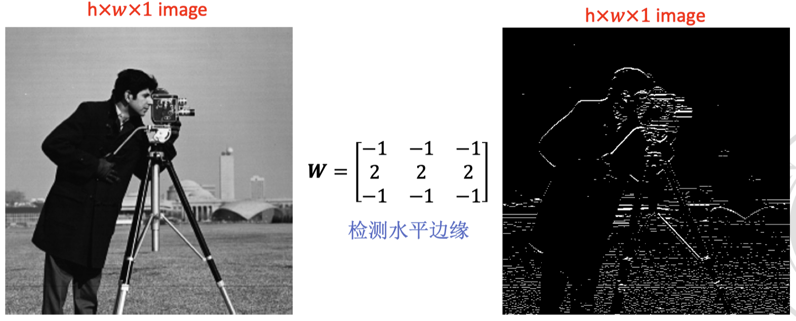
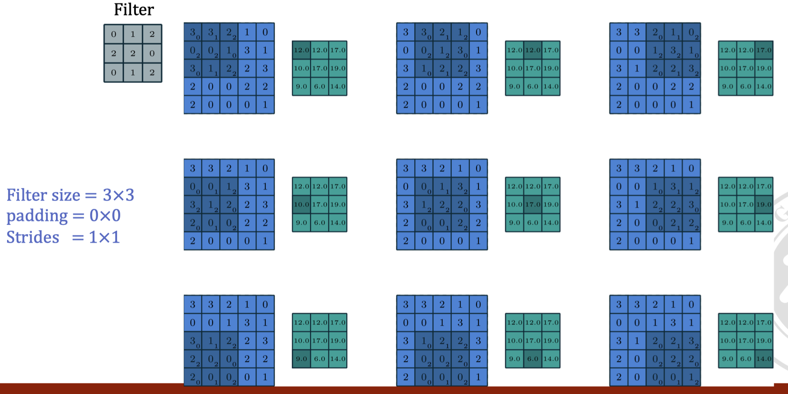
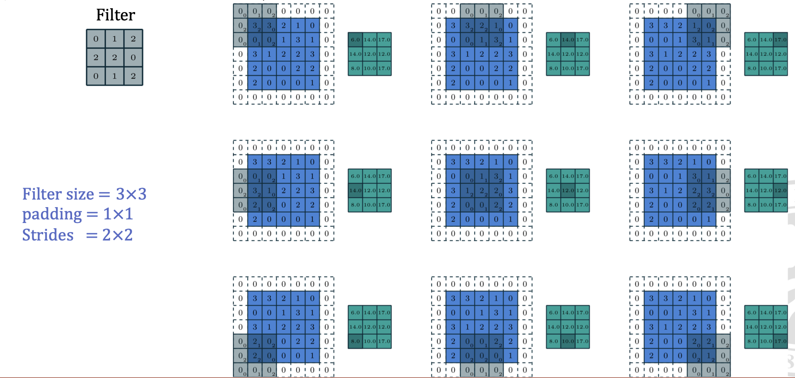
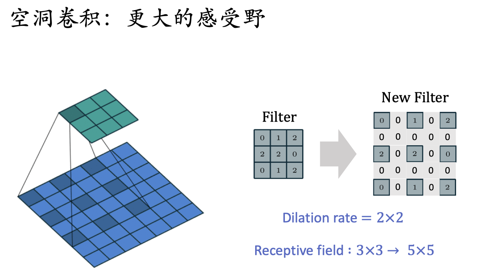
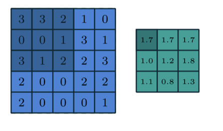
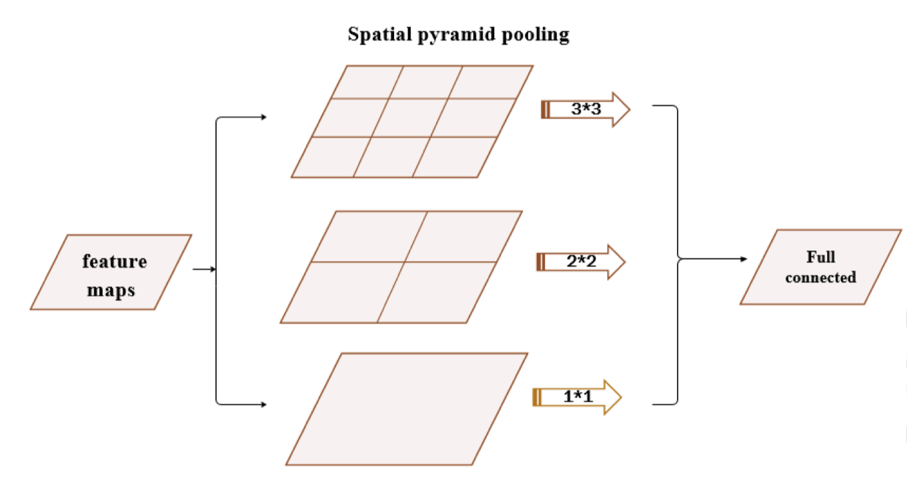
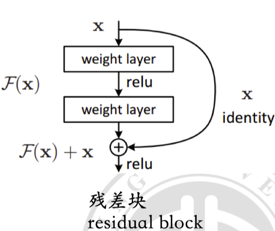
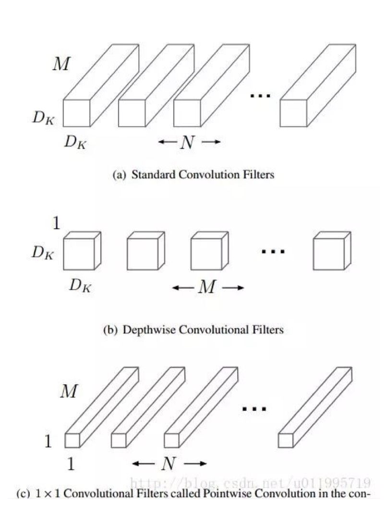

# 卷积神经网络

  by <a href="https://github.com/zhuozhiyongde">Arthals</a> / GPT4 / Claude 3 Opus
   
  blog: <a href="https://arthals.ink">Arthals' ink</a>

## 动机

对于真实图像，其动辄几万几十万像素，尺寸太大，导致全连接层的维数过高，参数过多，计算量过大，内存不足。

**平移不变性**：图像中的物体不管在图像中的位置如何变化，我们都能够识别出来。我们不会具体的对每一个像素点进行识别，而是对图像中的一些 **特征** 进行识别，这些特征是与 **位置无关** 的。比如我们可以识别出一张人脸，不管这张人脸在图像中的位置如何变化，我们都能够识别出来。这就是平移不变性。这进而引出了卷积神经网络（Covolutional Neural Network，CNN）的一些概念：

-   **空间上的权值共享**：卷积核在图像上滑动，对图像的 **不同位置使用的是同一个卷积核** （或滤波器），其权值在整个输入图像上共享。这对应我们的平移不变性（也即我们平等的对待图像中的每一个 **位置** ，注意这里不是像素哦，你可以理解位置是一片像素）。这显著减少了模型的参数数量。
-   **稀疏连接**：卷积核的大小远小于输入图像的大小，每个输出神经元（后一层特征图的每个像素）仅与前一层特定局部区域（这一区域称为 **感受野** ）内的神经元存在连接，这使得使网络专注于局部特征，并减少计算量（与之相对的，全连接层的是稠密连接，每一个全连接层的神经元都与前一层所有输出相连）。
-   **等变表示** ：指的是卷积神经网络对输入数据的某种变换（如平移）具有不变性。由于权值共享，如果输入图像发生平移，卷积层的输出也会相应地平移，但是提取的特征类型不变。这种性质使得 CNN 对图像位置的变化具有一定的鲁棒性（也称健壮性）。

## 卷积算法（Convolution）

### 2D 卷积

$$
s_{r,c} = (x * W)_{r,c} = \sum_{i} \sum_{j} x_{r+i,c+j} \cdot w_{i,j}
$$

其中：

-   $x$ 是输入图像
-   $W$ 是卷积核
-   $s_{r,c}=(x*W)_{r,c}$ 是输出图像的像素值，$r$ 和 $c$ 分别是输出图像的行和列
-   $i$ 和 $j$ 分别是卷积核的行和列，其范围为对应的卷积核大小
-   $w_{i,j}$ 是卷积核 $W$ 的权重

或者可以通过转变坐标，改写为

$$
s_{r,c}=(x*W)_{r,c}=\sum_{i=-\infty}^{\infty}\sum_{j=-\infty}^{\infty}x_{i,j}w_{r-i,c-j}
$$

举个例子，一个检测水平边缘的卷积核可以是：

$$
\begin{bmatrix}
-1 & -1 & -1 \\
2 & 2 & 2 \\
1 & 1 & 1
\end{bmatrix}
$$

为什么这个卷积核可以检测水平边缘呢？我们可以看到，这个卷积核的中间一行是 2，上下两行是 -1，回忆一下，当滤波器与输入序列的局部路径在某个位置非常接近（也即卷积核权值大的地方原图数值也高，想想 [排序不等式](https://zh.wikipedia.org/zh-hans/%E6%8E%92%E5%BA%8F%E4%B8%8D%E7%AD%89%E5%BC%8F)）时，卷积操作的结果（输出序列中的一个值）将会很高。也就是说，对于这个卷积核，当输入图像存在一个水平边缘时，卷积操作的结果将会很高。

值得一提的是，对于有多个通道（RGB）的真实图像，每个通道上都需要应用一个卷积核（可以相同 / 不同，如果不同），然后将这些通道的输出相加，得到最终的输出。

### 填充（padding）

迄今为止，我们提到的卷积核都是步长为 1 的，其对应的卷积后大小的公式是：

$$
\text{output\_size} = \left\lfloor \frac{\text{input\_size} - \text{filter\_size}}{1} \right\rfloor + 1
$$

这直接导致了卷积后的图像大小缩小：

为了维持输出图像的尺寸，或者让步长（stride）能够整除图像尺寸，我们使用填充（padding）在图像周边添加数值为 0 的空像素（一般来讲，四周的填充数值相等，因而下式对横竖两个方向同时成立）。此时，若步长为 1，考虑到取整的情况，卷积后输出尺寸的公式是：

$$
\text{output\_size} = \left\lfloor \frac{\text{input\_size} + 2 \times \text{padding} - \text{filter\_size}}{1} \right\rfloor + 1
$$

对于步长不为 1 的情况，在此给出更泛化的步长公式，同样考虑到取整的情况，是：

$$
\text{output\_size} = \left\lfloor \frac{\text{input\_size} + 2 \times \text{padding} - \text{filter\_size}}{\text{stride}} \right\rfloor + 1
$$

其中：

-   $\text{input\_size}$: 输入图像的尺寸（高度或宽度）
-   $\text{padding}$: 填充的像素数
-   $\text{filter\_size}$: 卷积核的尺寸（高度或宽度）
-   $\text{stride}$: 步长
-   $\text{output\_size}$: 卷积后输出图像的尺寸（高度或宽度）
-   $\left\lfloor \cdot \right\rfloor$: 向下取整符号

如何理解这个公式？你可以这么想，$\text{input\_size} + 2 \times \text{padding} - \text{filter\_size}$ 是你可滑动的范围，而 $\text{stride}$ 是你每次滑动的步长，那么你最多可以滑动多少次呢？显然是 $\left\lfloor \frac{\text{input\_size} + 2 \times \text{padding} - \text{filter\_size}}{\text{stride}} \right\rfloor$ 次，因为你的最后一次滑动可能不足一个步长。最后再加上最开始一次，就得到了原式。

### 卷积核形状（Kernel/Filter shape）

卷积核的形状对于卷积操作非常重要。对于 RGB 图像，卷积核的形状为：

$$
(\text{filter\_height} \times \text{filter\_width} \times \text{input\_channels} \times \text{n\_filters})
$$

其中：

-   $\text{filter\_height}$: 卷积核的高度
-   $\text{filter\_width}$: 卷积核的宽度
-   $\text{input\_channels}$: 输入图像的通道数（对于 RGB 图像，通常为 3）
-   $\text{n\_filters}$: 卷积核的数量

不同于单个二维平面的卷积核，我们现在讲述的是，采用多个不同的卷积核（注意，这里说的卷积核是 **立体** 的，单个大小为 $\text{filter\_height} \times \text{filter\_width} \times \text{input\_channels}$）来提取不同的特征，然后将每个卷积核的输出作为一个新的通道，最后将这些通道的输出在通道维度上拼接在一起（注意此时各个卷积核的输出不再是数值上相加，而是类似 RGB 通道一样，在通道这个维度上叠在一起），得到最终的输出。

在这种情况下，每个卷积核负责提取输入图像的一个特定特征，并产生一个输出特征图。输出特征图的形状为：

$$
(\text{feature\_height} \times \text{feature\_width} \times \text{n\_filters})
$$

其中：

-   $\text{feature\_height}$: 输出特征图的高度
-   $\text{feature\_width}$: 输出特征图的宽度
-   $\text{n\_filters}$: 卷积核的数量

这里特征图的尺寸由输入图像的大小、填充、步长和滤波器大小共同决定。

### 感受野（Receptive field）

感受野指的是 **输出特征图** 上的一个元素（或者说像素）在原始输入图像上映射的区域大小。

尤其需要注意，这里是输出特征图，而不是输入的！

可以预想到，在多层卷积网络中，随着层数的增加，感受野会变大（类似于生物学中的瀑布效应），这意味着网络能够捕获更大范围的上下文信息（也即，高层的特征图中的单个像素会对应于原始图像中更大的区域）。

#### 感受野的计算

$$
RF_{i+1}=RF_i+(k-1)\times S_i
$$

其中：

-   $RF_i$ 是第 $i$ 层的感受野
-   $RF_{i+1}$ 是第 $i+1$ 层的感受野，也即当前层
-   $k$ 是 **当前层的卷积核** 的大小
-   $S_i$ 是之前所有层的步长的乘积（ **不包括本层** ），也即 $S_i=\prod_{j=1}^{i}stride_j$
-   注意 **当前层的步长并不影响当前层的感受野，感受野和填补（padding）也没有关系**

这个公式不难理解，假设当前层为 2（$i+1=2$），对于上一层 $i$ 输出的特征图（也即本层的输入特征图）来说（图中 Layer2），一个像素的感受野是 $RF_i$（图中 Layer1 的绿色部分），那么当前层 $i+1$ 由于是从上一层卷过来的，所以一个像素代表了卷积核的大小 $k \times k$，而由于步长的存在，这个感受野会在上一层的基础上扩大 $k-1$ 个步长的累乘。

我们上一张图举例：

**Layer1**

-   由于是初始层，定义 $RF_0=1$，$k=3$，$Stride_0=1$，$S_0=1$
-   因此 $RF_1=1+(3-1)\times 1=3$
-   注意，感受野说的是输出的特征图的每个像素代表的原始图像尺寸，所以 Layer1 的感受野是图中 Layer2 中的一个像素代表的原始范围。

**Layer2**

-   $RF_1=1$，$k=3$，$Stride_2=2$，$S_1=1$
-   因此 $RF_2=3+(3-1)\times 1=5$

**Layer3**

-   $RF_2=5$，$k=3$，$Stride_3=1$，$S_2=2$
-   因此 $RF_3=5+(3-1)\times 2=9$

#### 空洞卷积

空洞卷积（dilated convolution）：可以增加感受野而不增加参数数量。这是由于采样变得更加稀疏导致的，在实现上，这对应在卷积核中间插入 0，使得卷积核的感受野变大：

与正常的卷积不同，空洞卷积引入了一个叫做 **膨胀率（dilation rate）** 的参数，用于控制卷积核中间的 0 的插入间隔。膨胀率为 1 时，空洞卷积退化为正常的卷积。膨胀率为 2 时，卷积核中间插入一个 0，膨胀率为 3 时，卷积核中间插入两个 0，以此类推。

空洞卷积的卷积核需要进行调整后才能使用正常卷积的感受野计算公式：

$$
k' = k + (k-1) \times (d - 1)
$$

其中：

-   $k'$ 是调整后的卷积核大小
-   $k$ 是原始卷积核大小
-   $d$ 是膨胀率

不难理解这个式子，空洞卷积相当于在原有卷积核中插入了 $k-1$ 次，每次插入 $d-1$ 个 0。

计算感受野需要使用调整后的卷积核大小 $k'$：

$$
RF_{i+1}=RF_i+(k'-1)\times S_i
$$

其中各参数定义如前。

空洞卷积与反卷积的区别：反卷积（Deconvolution）主要用于增大图像尺寸，是 **上采样（upsampling）** 的一种，而空洞卷积并没有做上采样，**空洞卷积是为了在卷积核中间插入 0**，以增大感受野，它可以不改变图像的大小。**而反卷积是在输入的基础上插入 0**，以此来增大图像的尺寸，从而增大输出的特征图的尺寸。

### 3D 卷积

回想我们之前提到的 2D 卷积，我们总是在原图像的各个通道的二维平面上滑动卷积核，实现卷积操作。一个不恰当的比喻是，在这种情况下，把图片视为一个三维的像素块，那么其在 “深度”（也就是原先的通道数）上，长度恒为 3，而且此时一个卷积核在 “深度” 这个维度上的输入长度等于输入图像的 “深度” 数。这意味着我们的卷积核在这个维度上是 **“全连接”** 的而非 “滑动” 的。

然而，在处理医学 MRI 图像时，我们通常会遇到 3D 体素数据，即数据是以三维形式存在的。与 2D 卷积相比，3D 卷积在深度方向上也有扩展（可能有几百几千个像素）。因此，我们可以将 2D 的通道概念推广到 3D 的深度维度，在这个维度上，也实现一个卷积核的滑动。

因此，在 3D 卷积中，卷积核不仅在宽度和高度上移动，还在深度上移动。卷积核会有一个额外的维度，即深度。这意味着，如果我们有一个形状为 $(D, H, W)$ 的三维数据，卷积核可能会有一个形状为 $(d, h, w)$，其中 $d, h, w$ 分别对应卷积核在深度、高度和宽度方向上的尺寸。

对于一个具有多个通道（是的，三维图像也可以有通道数，这里的通道可以类似二维的 RGB 类比，MRI 存在不同的加权 T1，T2 像，或者你理解为一个 3D 的彩色图像？）的 MRI 图像，卷积核的形状将是 $(\text{depth} \times \text{height} \times \text{width} \times \text{input\_channels} \times \text{n\_filters})$。

此时，输出的通道数依旧是卷积核的数量 $\text{n\_filters}$，但是输出的特征体的形状将会是 $(D', H', W', \text{n\_filters})$，其中 $(D', H', W')$ 是输出特征体的尺寸，这些尺寸取决于输入尺寸、卷积核尺寸、步长（stride）和填充（padding）策略。

## 池化（Pooling）

池化算法是一种在卷积神经网络中常用的操作，其动机在于增强模型对输入数据中小的平移变化的不变性，即当输入图像稍微移动时，网络的输出不应产生大的变化。

可以这么理解：**池化是一种特殊的卷积操作**，它 **没有一个可学习的参数** （即一般卷积核的权重），只是对输入数据进行一种固定的操作。池化操作可以 **减少特征图的尺寸** ，减少计算量和参数数量，同时提高模型的鲁棒性。

常见的池化方法包括：

### MaxPooling：取区域内的最大值

### MeanPooling：取区域内的平均值

### 空间金字塔池化：在不同尺度上执行池化，以捕获多尺度信息

动机：如果我们只是简单的进行一个固定尺度的池化，那么可能会丢失一些重要的信息。例如，我们将一张 $100 \times 100$ 的图像简单的池化，那么：

-   如果我们采用很大的池化尺寸，比如 $50 \times 50$，那么我们会丢失很多细节信息
-   如果我们采用很小的池化尺寸，比如 $2 \times 2$，那么我们会丢失很多全局信息

因此，我们可以在不同尺度上执行池化，然后将这些不同尺度的特征 **拼接** 在一起 ~~（既要又要行为）~~，以捕获多尺度的信息。这种方法被称为空间金字塔池化（Spatial Pyramid Pooling）。

其具体步骤为：

1. 输入特征图被划分成不同尺度的区域网格，如 $3\times3$、$2\times2$ 和 $1\times1$。
2. 在每个区域网格内执行池化操作（如最大池化或平均池化），得到不同尺度的特征向量。
3. 将这些不同尺度的特征向量 **拼接** 起来，形成最终的特征表示。注意这里的拼接不同于简单的相加，而是将不同尺度的特征向量 **在通道维度上 “串连” 起来**。

### 池化操作的注意事项

-   池化层一般会减小特征图的尺寸，这点需要在设计网络时考虑
-   池化层的使用能够减少参数数量，从而减少计算量和过拟合的风险
-   在设计 CNN 时应合理选择池化策略，以保持特征的有效性
-   **池化的感受野计算同正常卷积层**

## 分层表示学习（Hierarchical Representation Learning）

在 CNN 中，我们通过堆叠多个卷积层和池化层来逐渐提取图像的高级特征，实现 **层次化的特征学习** 。这种网络中，越低的层次（感受野小）提取的是图像的低级特征，如边缘、纹理等，而越高的层次（感受野大）提取的是图像的高级特征，如物体的形状、部分等。

## 卷积架构（Convolutional Architecture）

### AlexNet

首次引入 ReLU 激活函数、Dropout 技术，以及数据增强，提高了模型的训练效率和泛化能力。

AlexNet 采用了 8 层深的网络结构，证明了深度网络的潜力。

### VGG

VGG 网络采用了连续的小尺寸卷积核（$3\times3$），通过层叠多个卷积层来提高网络的深度，增强了模型的表达能力。其特点包括：

-   **小尺寸卷积核** ：使用连续的 $3\times3$ 卷积层，这种设计可以用更少的参数量达到与大尺寸卷积核相同的感受野。
-   **层叠效应** ：两个 $3\times3$ 卷积层的感受野等于一个 $5\times5$ 卷积层，三个则等效于 $7\times7$。这种设计增加了网络的深度，同时引入了更多的非线性变换，提高了模型的表达能力。

### ResNet

ResNet 通过引入 **残差（residual）** 学习解决了深度网络训练难的问题，成功训练了超过 100 层的网络，证明了超深网络的潜力。

残差学习是一种帮助深层神经网络更好地训练的技术，特别是在网络非常深时。它是通过引入所谓的 **“残差块”** 来实现的，这些残差块使得网络可以 **学习到输入和输出之间的差异，即残差**，而不是直接学习一个完整的输出。

在深度学习中，理论上 **网络越深，其表达能力越强**。但实际上，随着网络层数的增加，训练网络变得越来越困难。这是因为存在所谓的梯度消失和梯度爆炸问题，即在深层网络中，梯度（用于更新网络权重的信息）在传播过程中会变得非常小或非常大，导致网络 **难以训练** 。虽然理论上讲，经过足够多的训练，我们总是可以让网络收敛，但实际上，这种训练过程会变得非常缓慢，甚至无法收敛。

残差学习通过在网络中引入 **“快捷连接”（也称为 “跳跃连接”）** 解决这个问题。这些连接允许一部分输入直接 “跳过” 一或多层，然后与这些层的输出相加。这样，网络就可以学习到输入和输出之间的 **残差** 。如果输入和输出之间没有太大差异，网络可以学习到一个接近零的残差，这使得网络训练变得更加容易。

用数学语言简单表达，假设我们希望学习的目标映射为 $H(x)$，我们让网络去拟合残差映射 $F(x) = H(x) - x$。则原始的映射目标可以表示为 $H(x) = F(x) + x$。这里的 $x$ 即为通过 “快捷连接” 直接传递的输入部分，$F(x)$ 是网络中几层的输出部分，二者相加即得到最终的输出。

一个直观的理解是，我们的网络总是很容易的学到一个权重为 0 的 **恒等映射**，这等价于直接将输入传递给输出。也等价于一个层数少一层的网络。多次利用这种关系，我们就可以保证 **提高网络的深度不会带来性能的下降** 。

### 深度可分离卷积

深度可分离卷积（Depthwise Separable Convolution）是一种高效的卷积操作，由两个步骤组成：

1.  **深度卷积（Depthwise Convolution）** ：对每个输入通道单独进行卷积操作。
2.  **逐点卷积（Pointwise Convolution）**：使用长宽维度上为 $1\times1$ 的卷积核对深度卷积的输出的每个位置进行卷积，组合来自 **不同通道** 的信息。

#### 乘法次数比较

-   标准卷积所需的乘法次数为：

    $$
    \text{filter\_size\_height} \times \text{filter\_size\_width} \times \text{height} \times \text{width} \times \text{in\_channels} \times \text{out\_channels}
    $$

-   深度卷积所需的乘法次数为：

    $$
    \text{filter\_size\_height} \times \text{filter\_size\_width} \times \text{height} \times \text{width} \times \text{in\_channels}
    $$

-   逐点卷积所需的乘法次数为：

    $$
    \text{height} \times \text{width} \times \text{in\_channels} \times \text{out\_channels}
    $$

深度可分离卷积通过分解标准卷积操作，大幅减少了所需的计算量。

这张图非常形象了，你可以把这张图中出现的每个立方体看做一个卷积范围，其中单位体积对应一次乘法。可以看到，相较于标准卷积（a），深度可分离卷积（b+c）的乘法次数大大减少。

### 转置卷积 / 反卷积（Transpose Convolution/Deconvolution）

转置卷积 / 反卷积主要用于 **上采样（Upsampling）** 操作，即将较小的数据特征图扩大到较大的尺寸。其基本原理是对输入特征图进行 “填充” 和 “扩展”，然后应用标准卷积操作。

> 上采样可以理解为下采样的逆过程，即将特征图的尺寸从小变大。

假设我们有一个 $H \times W$ 的输入特征图（例如图像），我们想将其上采样至更大的尺寸。转置卷积操作可以表示为：

1.  **插值步骤（Interpolation Step）** ：首先，在输入特征图的元素之间插入零，增加特征图的尺寸。

2.  **卷积步骤（Convolution Step）** ：接下来，对扩大后的特征图应用一个标准的卷积操作。假设使用的卷积核大小为 $k \times k$，则此步骤相当于在扩大的特征图上滑动卷积核，计算卷积输出。

给定输入特征图 $X$，转置卷积操作可以用以下公式表示：

$$
Y = f_{\text{conv}}(Z(X, s-1,p), K)
$$

其中：

-   $Y$ 是输出特征图
-   $f_{\text{conv}}$ 表示卷积函数
-   $Z(X, s-1, p)$ 表示在输入特征图 $X$ 中插入零的操作。
-   $K$ 是卷积核。

反卷积提供了一种从较小特征图生成较大特征图的有效方式，对于需要恢复图像细节或扩大特征图尺寸的任务来说非常重要。（这个思想在 U-Net 等网络中被广泛应用！）

#### 反卷积的感受野计算

反卷积（Deconvolution）通常用于神经网络中的上采样，是卷积的逆过程（并不严格）。反卷积输出尺寸的公式是：

$$
o = (i - 1) \times s + k - 2p
$$

其中：

-   $o$：输出尺寸。
-   $i$：输入尺寸。
-   $s$：步长。
-   $k$：卷积核尺寸。
-   $p$：填充。

这个公式是由正常的卷积公式中调换 $i$ 和 $o$​ 然后进行推导得到的。

注意这里别想着用正常的填 0 操作来正着推，你就记得他是反着卷的就行，填 0 哪里我也没搞清楚是怎么填的，他似乎并不是严格按照步长去填的...

## Credit

[dreamer5z / 感受野与空洞卷积](https://blog.csdn.net/hfuter2016212862/article/details/105931187)
