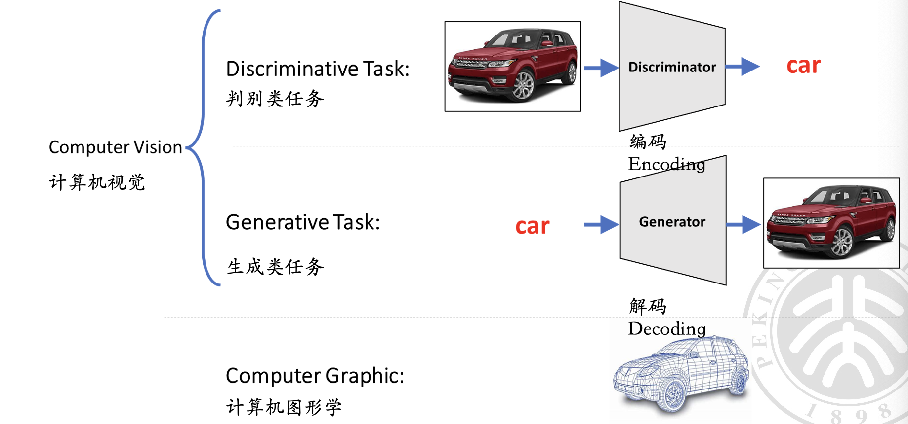
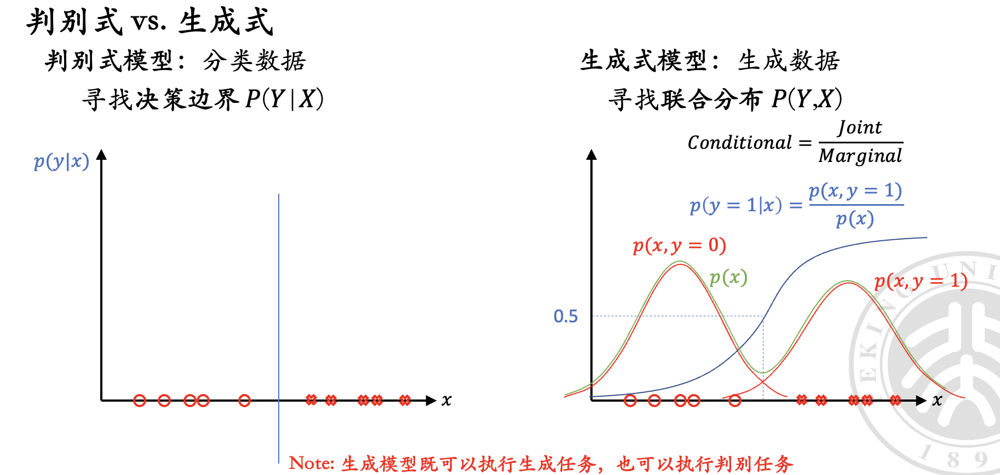
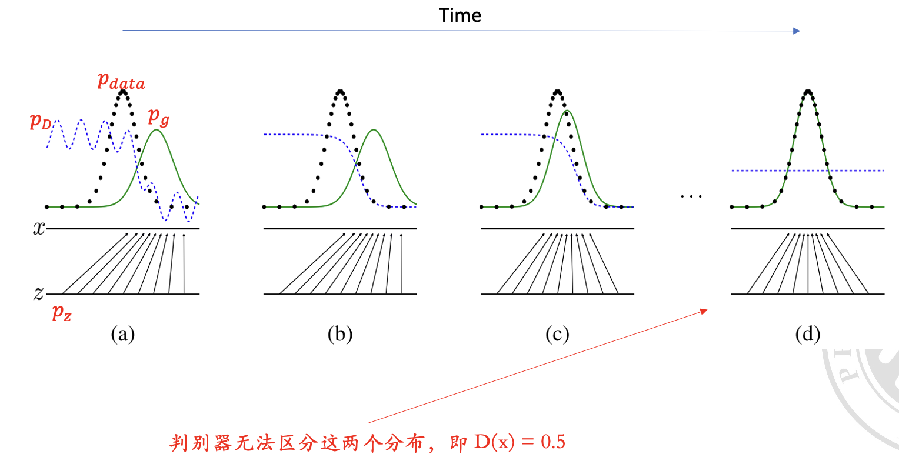
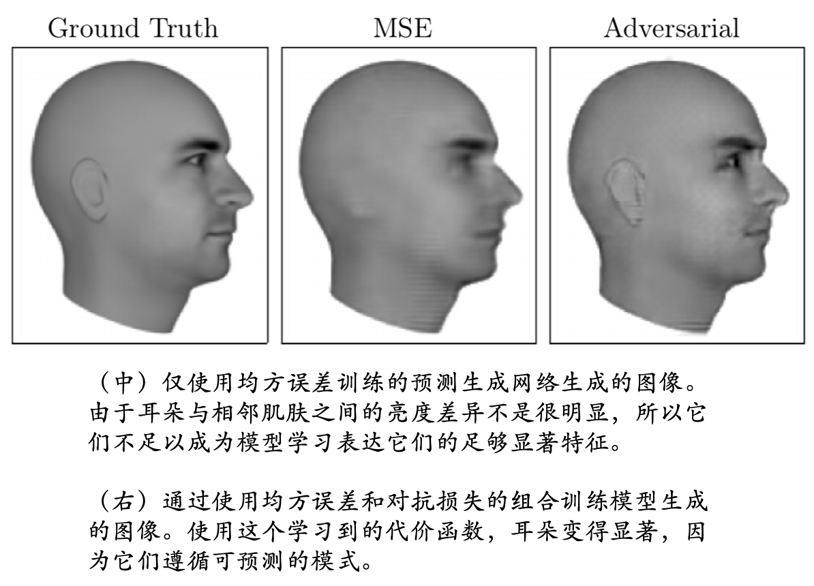

# 对抗神经网络

  by <a href="https://github.com/zhuozhiyongde">Arthals</a>
   
  blog: <a href="https://arthals.ink">Arthals' ink</a>

## 动机

### 计算机视觉与计算机图形学

**计算机视觉** （Computer Vision）

-   判别任务（Discriminative Task）：从图像中辨识出物体，如识别一辆车。
-   生成任务（Generative Task）：从标签生成对应的图像，如根据 “车” 的标签生成车辆图像。

**计算机图形学** （Computer Graphics）

-   通过编码（Encoding）和解码（Decoding）过程，实现从描述性数据生成图像。

两者关系：

## 计算机图形学与统计生成模型

-   计算机图形学依赖大量 **先验知识（Prior Knowledge）** ，如材料、物理建模、光照等，来精确地生成图像。
-   统计 / 深度生成模型（Statistical/Deep Generative Model）则通过学习 **大量数据**，尝试减少对先验知识的依赖。

如何区分先验知识和数据？

-   **先验知识** ：在模型训练或图像生成前已经存在的知识，如物理规则或专家知识。
-   **数据** ：模型训练或图像生成过程中使用的数据。

注意，统计 / 深度生成模型仍然需要一些先验知识（如假定数据的分布），但是相比计算机图形学，它们更多地依赖数据。

## 生成式模型

### 生成模型与概率分布

生成模型的目的是为了 **学习数据的概率分布** $p(x)$。理解了这个分布后，我们可以通过采样（sampling）来生成新的数据样本，即 $x_{new} \sim p(x)$。

初学的时候可能不容易理解这个概念，我们可以先类比到最简单的一维数据集上。假设我们有一个一维数据集 $D = \{x_1, x_2, \ldots, x_n\}$，其中每个样本不过是一个实数。

我们考虑如何在已知这些数据 $D$ 的情况下，生成新的数据样本。很自然的想法是，通过密度估计（density estimation）来估计数据的概率分布 $p(x)$。这里的密度估计指的是我们希望找到一个概率分布 $p(x)$，使得这个分布能够很好地拟合数据 $D$。

很显然，我们可以假设数据服从正态分布 $N(x | \mu, \sigma^2)$，通过最大似然估计，我们可以求解出 $\mu$ 和 $\sigma^2$ 的值，从而得到一个正态分布 $N(x | \mu, \sigma^2)$，这个分布就是我们对数据的概率分布的估计。

然后，我们就可以通过这个正态分布来生成新的数据样本。

当我们把这个简单的一维数据集推广到高维数据集时，我们就得到了生成模型的基本思想。我们知道，图片可以看做是一个具有很高维度的向量，对应的，我们的数据集也就成为了一个高维数据集。类推低维情形，我们的目标就变成了学习这个高维数据集的概率分布，然后通过这个概率分布来生成新的数据样本。

这个过程中的一些重要的概念：

-   **概率分布** ：用来描述数据的可能性，可能需要先验假设，如正态分布 $N(x | \mu, \sigma^2)$。
-   **采样** ：从概率分布中生成新样本的过程。
-   **密度估计** ：通过数据集估计数据的概率分布。
-   **无监督表示学习** ：从数据中自动发现有用特征的过程，无需标签信息。

我们用数学化的语言来表达这个过程：

已知数据集 $D = \{x^1, x^2, \ldots, x^{|D|}\}$，我们希望学习数据的概率分布 $p_{data}$，即 $p_{data}(x) = p(x)$。我们的目标是通过训练一个模型，使得这个模型的概率分布 $p(x | \theta)$ 能够很好地拟合 $p_{data}$。

其中：

-   $x^j$：数据集 $D$ 中的第 $j$ 个样本，$j = 1, 2, \ldots, |D|$。
-   $p_{data}$：数据集 $D$ 中样本的真实概率分布，即实际观测到数据 $x$ 的概率。一般可以简化表示为 $p(x)$
-   $p(x | \theta)$：表示模型预测的概率分布，这个分布由模型参数 $\theta$ 决定。
-   $\theta$：模型参数，通过训练优化以使得 $p(x | \theta)$ 逐渐拟合 $p_{data}$。如果我们有先验知识（假定数据分布），那么可以将 $\theta$ 限制在一个特定的集合 $M$ 中，即 $\theta \in M$。

### 判别式 v.s. 生成式

## 朴素 GAN（Vanilla GAN）

引入 **生成对抗网络** （GAN，Generative Adversarial Networks）的动机是为了通过一种新颖的模型训练方法生成高质量、高分辨率的图片，同时减少对先验知识的依赖。

GAN 由两部分组成：生成器（Generator）和判别器（Discriminator）。生成器负责生成图像，判别器负责判断图像是真实的还是由生成器生成的。

GAN 的工作原理可以用一个游戏的比喻来理解：生成器试图制作假币，而判别器则像警察一样，试图区分真币和假币。在这个过程中，生成器不断学习如何更好地制造假币，而判别器则不断学习如何更准确地识别。最终，生成器将能够生成与真实货币极其相似的假币，判别器也将变得非常擅长识别。

这张图介绍了生成对抗网络（GAN）的基础概念。GAN 由两部分组成：生成器（$G$）和判别器（$D$）。

-   $z$：输入到生成器的随机噪声，通常来自于某种预定义的概率分布，如正态分布 $N(0,1)$。
-   $G$：生成器函数，它接收随机噪声 $z$，输出生成的数据 $\hat{x}$。
-   $D$：判别器函数，它的输入是真实数据 $x$ **或** 生成的数据 $\hat{x}$，输出该数据为真实数据的概率。

在数学上，这个过程可以表示为一个极小极大问题：

$$
\min_G \max_D V(D, G) = \min_G \max_D \mathbb{E}_{x\sim p_{\text{data}}(x)}[\log D(x)] + \mathbb{E}_{z\sim p_z(z)}[\log(1 - D(G(z)))]
$$

其中：

-   $\mathbb{E}_{x\sim p_{data}}[\log D(x)]$：当真实数据 $x$ 来自数据分布 $p_{data}$ 时，判别器判断正确的期望值。$D(x)$ 的输出是一个概率值，表示判别器认为 $x$ 是真实数据的概率。如果判别器能准确识别真实数据，这个值会很大，因为 $\log D(x)$​ 会接近于 0（注意其他情况下是负数）。

    注意，$D(x)$ 接近于 1，表示判别器认为 $x$ 是真实的。

-   $\mathbb{E}_{z\sim p_z}[\log(1 - D(G(z)))]$：当生成的数据 $G(z)$ 来自噪声分布 $p_z$ 时，判别器判断正确的期望值。$G(z)$ 的输出是一个图像，用以送入判别器判断这个图像是真实的还是生成的。如果判别器能准确识别出生成的数据不是真实的，这个值也会很大，因为 $\log(1 - D(G(z)))$ 会接近于 0

    注意，如果 $D (G (z))$ 接近于 0，则表示判别器认为生成的 $G(z)$ 不是真实的。

-   $G$ 试图最小化这个函数 $V(D, G)$

-   $D$ 试图最大化这个函数 $V(D, G)$

-   $p_{\text{data}}$ 是真实数据的分布

-   $p_z$ 是生成器输入的噪声分布

由此，我们可以定义生成器和判别器各自的损失函数：

$$
\begin{aligned}&\mathcal{L}_{D}=-\mathbb{E}_{x\sim p_{data}}[\log D(x)]-\mathbb{E}_{z\sim p_z}[\log(1-D(G(z))]\\&\mathcal{L}_{G}=-\mathbb{E}_{z\sim p_z}[\log D(G(z))]\end{aligned}
$$

判别器的损失函数 $\mathcal{L}_D$：第一部分是使得判别器能够正确识别真实数据，第二部分是使得判别器能够正确识别生成器产生的假数据。

生成器的损失函数 $\mathcal{L}_G$​：使得生成器产生的假数据尽可能让判别器误认为是真实数据。

简而言之，GAN 的训练就是一个博弈过程，生成器和判别器不断地互相竞争，最终目标是让生成器能生成与真实数据几乎无法区分的假数据。

**单向映射**：指生成器 $G$ 的作用，它将输入的随机噪声 $z$ 单向映射成尽可能接近真实数据分布的数据 $\hat{x}$，而 **不能映射回来**。也即，生成器 $G$ 接收一个随机的潜在空间分布（通常是正态分布或均匀分布）作为输入，并生成一个与真实数据分布相似的分布。

我们可以表示出最优的生成器和判别器：

$$
G^*=\min_G\mathbb{E}_{z\sim p_z}[\log(1-D(G(z)))]
$$

$$
D^*=\max_D\mathbb{E}_{x\sim p_{data}}[\log D(x)]+\mathbb{E}_{z\sim p_z}[\log(1-D(G(z)))]
$$

### 深入理解目标函数

理论上，生成器（$G$）和一个判别器（$D$）的博弈的解是生成器产生的数据分布 $p_g$ 与真实数据分布 $p_{data}$ 完全一样。

以下我们对这个结论做出推导。

回忆损失函数：

$$
\begin{aligned}&\mathcal{L}_{D}=-\mathbb{E}_{x\sim p_{data}}[\log D(x)]-\mathbb{E}_{z\sim p_z}[\log(1-D(G(z))]\\&\mathcal{L}_{G}=-\mathbb{E}_{z\sim p_z}[\log D(G(z))]\end{aligned}
$$

将生成器隐去，也即我们认为当 $z\sim p_z$ 时，$G(z)$ 的分布为 $p_g$，那么我们得到：

$$
\min_G\max_DV(G,D)=\min_G\max_D\mathbb{E}_{x\sim p_{data}}[\log D(x)]+\mathbb{E}_{x\sim p_g}[\log(1-D(x)]
$$

这个价值函数等价于：

$$
V(G,D) = \int_{x} p_{\mathrm{data}}(x) \log(D(x)) dx + \int_{x} p_{g}(x) \log(1-D(x)) dx
$$

我们想要找到函数 $V(G,D)$ 的最大值，这对应于判别器尽可能正确地区分真实数据与生成数据。

对 $D$ 求导并设其导数为零，我们可以找到最优的判别器 $D^*$，使得 $V(G,D)$ 最大化：

$$
V(G,D)' = \frac{p_{data}(x)}{D(x)} - \frac{p_g(x)}{1 - D(x)} = 0
$$

因而，我们可以得到最优判别器 $D^*$ 的表达式：

$$
D^*(x) = \frac{p_{data}(x)}{p_{data}(x) + p_g(x)}
$$

这个解告诉我们，最优的判别器 $D^*$ 在任何点 $x$ 上的值是由真实数据分布 $p_{data}(x)$ 与生成数据分布 $p_g(x)$ 的相对概率决定的。当这两个分布相等时，即 $p_g = p_{data}$，判别器 $D^*$ 将无法区分真实数据与生成数据，此时生成器达到了其最优状态。

所以，当生成器 $G$ 固定时，**最优判别器 $D^*$ 的表达式为：**

$$
D^* = \frac{p_{data}}{p_{g} + p_{data}}
$$

当 $p_g = p_{data}$ 时，$D^*$ 对任何输入的评估都是 0.5，意味着它不能区分真假数据。

接下来，我们将探讨在判别器 $D$ 固定的情况下，生成器 $G$ 的最优解。

我们定义了生成器的价值函数 $C(G)$，在最优判别器 $D^*$ 的条件下，$C(G)$ 的表达式为：

$$
C(G) = \max_{D} V(G,D)
$$

这个函数可以进一步写为：

$$
C(G) = \mathbb{E}_{x\sim p_{\mathrm{data}}}[\log D_{G}^{*}(x)] + \mathbb{E}_{x\sim p_{g}}[\log(1 - D_{G}^{*}(x))]
$$

将最优判别器 $D^*$ 的表达式代入上述成本函数，我们得到：

$$
C(G) = \mathbb{E}_{x\sim p_{\mathrm{data}}}\left[\log\frac{p_{\mathrm{data}}(x)}{p_{\mathrm{data}}(x) + p_{g}(x)}\right] + \mathbb{E}_{x\sim p_{g}}\left[\log\frac{p_{g}(x)}{p_{\mathrm{data}}(x) + p_{g}(x)}\right]
$$

回顾一下 KL 散度的定义：

$$
KL(P||Q) = \int P(x) \log \frac{P(x)}{Q(x)} dx = \mathbb{E}_{x\sim P}[\log \frac{P(x)}{Q(x)}]
$$

继而给出 Jensen-Shannon 散度（JS 散度）的定义：

$$
JS(P||Q) = \frac{1}{2} KL(P||\frac{P+Q}{2}) + \frac{1}{2} KL(Q||\frac{P+Q}{2})
$$

不难发现，JS 散度是对 KL 散度的一种改进，它可以避免 KL 散度的不对称性。JS 散度的取值范围是 $0$ 到 $1$。

然后我们发现，$C(G)$ 可以表示为 JS 散度的形式：

$$
C(G) = -\log 4 + 2 \cdot JS(p_{\mathrm{data}} || p_{g})
$$

当 JS 散度取最大值 $1$ 时，$V(G,D)$ 取得最大值 $0$（这里的 $\log$ 是以 $2$ 为底的）。

因此，当生成器 $G$ 最优时，JS 散度为 $0$，这意味着 $p_{\mathrm{data}}$ 和 $p_{g}$ 两个分布相等。换句话说，当生成器 $G$ 能够生成与真实数据分布 $p_{\mathrm{data}}$ 相同的数据分布 $p_{g}$ 时，我们认为 $G$ 达到了最优。

综上所述，当判别器 $D$ 收敛，我们通过最优判别器 $D^*$ 的表达式，可以得出生成器的损失函数。这个损失函数表明，最优化生成器 $G$ 实际上是在最小化真实数据分布 $p_{\mathrm{data}}$ 与生成数据分布 $p_{g}$ 之间的 JS 散度。当生成器最优时，JS 散度为 $0$，意味着生成的数据分布与真实数据分布无法区分。

### GAN 的训练过程

GAN 的训练过程是一个迭代过程，包括以下步骤：

1. 采样一小批量的噪声数据 $z$，并用生成器 $G$ 生成假数据。
2. 同时采样一小批量的真实数据 $x$。
3. 用这些真实数据和假数据来更新判别器 $D$，使得 $D$ 能更好地区分真假数据。
4. 再次采样一批噪声数据，并用生成器 $G$ 生成新的假数据。
5. 更新生成器 $G$，使得 $G$ 生成的假数据能更好地 “欺骗” 判别器 $D$，让 $D$ 认为这些假数据是真的。

这个过程中，判别器 $D$ 通常会更新多次（$k$ 步），以便它能更准确地识别生成器 $G$ 产生的假数据。然后再更新一次生成器 $G$。这样交替更新的目的是让 $G$ 和 $D$ 在互相对抗中都能不断进步。

这里不会一开始就将判别器 $D$ 训练到最优，是因为这样会导致生成器 $G$ 难以对抗一个太强的判别器 $D$，可能会发生 **梯度消失**，即 $G$ 在更新时几乎不会得到有用的信息来改进自己。此外，如果 $D$ 太过完美，**$G$ 可能会陷入模式崩溃（Mode Collapse），即只生成极少数类型的数据**，失去了多样性。所以实际训练中，会寻找一个平衡点，让 $G$ 和 $D$ 都能得到有效的学习。

### 隐性插值

通过实验发现，GAN 能够通过随机噪声 $z$ 产生真实感的图像，但图像质量还需要改进。$z$ 值之间的插值操作可以在数据流形上产生平滑的过渡效果，而这种插值不是简单的线性过程，而是更加复杂且和谐的变化。

**隐性插值（latent interpolation）** ：指在生成对抗网络（GAN）中，对两个随机噪声向量（即隐空间中的点）$z_1$ 和 $z_2$ 进行插值，得到一个新的噪声向量 $z_{new}$。这个新向量可以被生成器用来产生介于两个原始向量对应图像之间的新图像。

数学上，这个插值过程可以表示为：

$$
z_{new} = \alpha \cdot z_1 + (1 - \alpha) \cdot z_2
$$

其中 $\alpha$ 是介于 0 到 1 之间的一个数，它决定了新向量是偏向于 $z_1$ 还是 $z_2$。

在高维数据空间中，这样的插值可以帮助我们探索数据的内在结构，即数据流形。在这个流形上，相似的数据点（如图像）靠得更近。通过隐性插值，我们可以平滑地从一个数据点过渡到另一个数据点，生成一系列连续变化的图像，这些图像在视觉上看起来是自然过渡的。

### GAN 的问题

在复杂数据集（如 CIFAR-10）上训练时，Vanilla GAN 可能效果较差，主要原因包括：

-   **架构限制**：Vanilla GAN 架构较为简单，未针对特定任务如图像生成进行优化，难以捕捉复杂数据特征和模式。

-   **训练不稳定**：生成器和判别器间的竞争可能导致训练不稳定，表现为模式崩溃（mode collapse）或梯度消失 / 爆炸，影响图像质量。

-   **损失函数限制**：使用的损失函数可能无法有效衡量生成图像与真实图像间的差异，难以捕捉复杂分布，导致图像质量下降。

-   **缺乏正则化**：未使用正则化技术约束参数，可能引起网络过拟合或欠拟合，影响图像生成质量。

其中最重要的问题，就是训练的时候，**G loss 和 D loss 是对抗的，很不稳定**，这跟 MLE 方法很不一样，在过去 MLE 方法中，loss 越小就越好，但现在变成两个网络相互对抗，loss 的数值不代表好还是不好。

## DCGAN（Deep Convolutional GAN）

DCGAN 是一种结合了卷积神经网络（CNN）和 GAN（生成对抗网络）的深度学习模型。DCGAN 的 Generator **使用卷积神经网络来生成图像**，而判别器（Discriminator）同样使用卷积网络来判断图像是真实的还是由生成器（Generator）生成的。

除此之外，DCGAN 的创新之处还体现在它使用了一系列的技巧来稳定训练过程，如使用批归一化（Batch Normalization）、去除全连接层、使用 ReLU 激活函数等。

## 对抗性损失 Adversarial Loss

对抗性损失是 GAN 中的一个核心概念，它是指 Generator 和 Discriminator 之间的对抗过程。**这种对抗性质使得 Adversarial Loss 在图像生成任务中比传统的均方误差（MSE）更加有效**，因为它能够促使生成的图像在视觉上更加逼真。

举个例子：

为什么会出现这种差异呢？因为如果这个耳朵不能被重建的话，判别器就会认为这个人像图不够真实，这是很容易被判别器发现的。

我们可以发现，对抗学习比 MSE 更加像人类，我们通常说 **对抗学习是一种自适应的损失函数** （Adversarial loss = automatic/adaptive loss），在训练不同阶段，它能够关注不同的东西。这是因为对抗损失 **不仅考虑像素级别的相似度，还考虑了图像的整体分布**。这意味着生成的图像在整体结构和细节上都更加逼真。

比方说，刚刚开始训练的时候，它可能先关注简单的东西，比如人像的轮廓，先让生成器能把轮廓给生成出来。

但是随着生成器能力的不断提高，它可能会开始关注细节信息了，比如眼睛、耳朵、嘴巴，让生成器能把细节生成出来。

所以对抗学习有这么一个 MSE 做不到的优点。

## 变分自编码器（Variational Autoencoder, VAE）

VAE（变分自编码器）是一种生成模型，它包含一个 Encoder **将数据编码为一个潜在空间的表示**，和一个 Generator（也称为 Decoder） **将潜在空间的表示解码回数据**。

**GAN 通常能够生成比 VAE 更清晰、更逼真的图像**，因为 GAN 的对抗性损失促使生成器学习到更加精细的数据分布，而 VAE 的重构损失和 KL 散度（KLD）则可能导致生成的图像较为模糊。

-   VAE = Generator + Encoder
-   Vanilla GAN = Generator + Discriminator
-   Better GAN = Generator + Discriminator + Encoder
