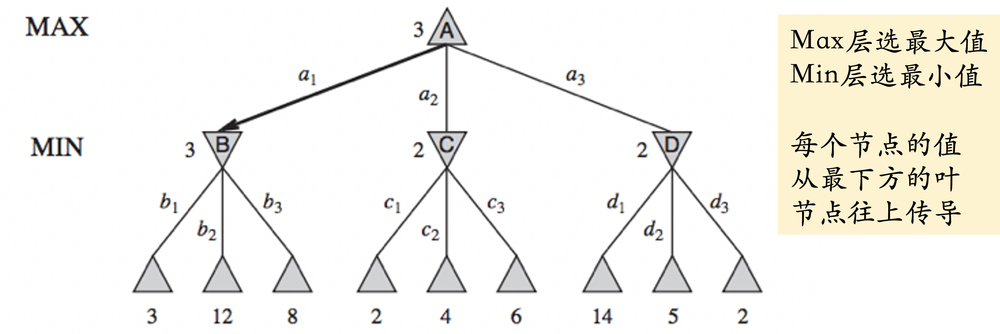
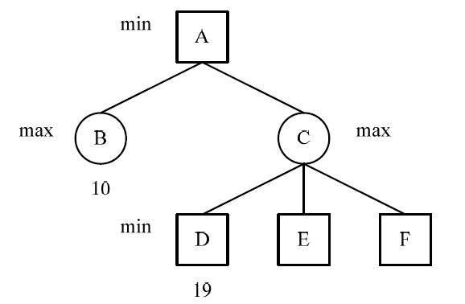
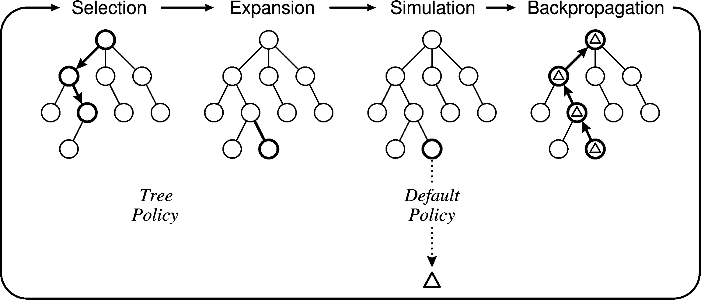
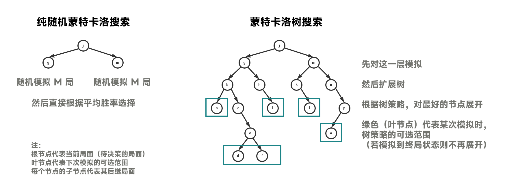
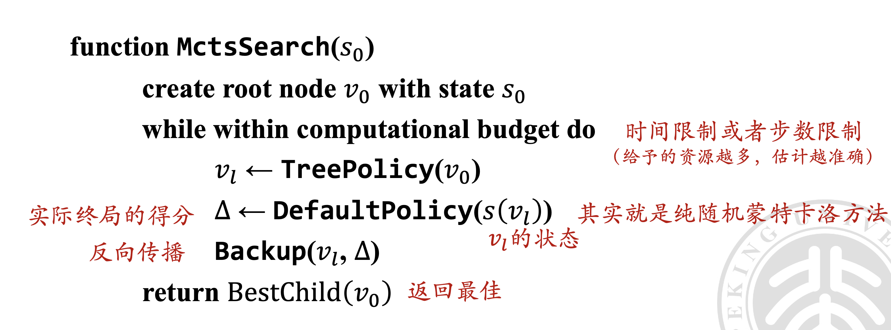
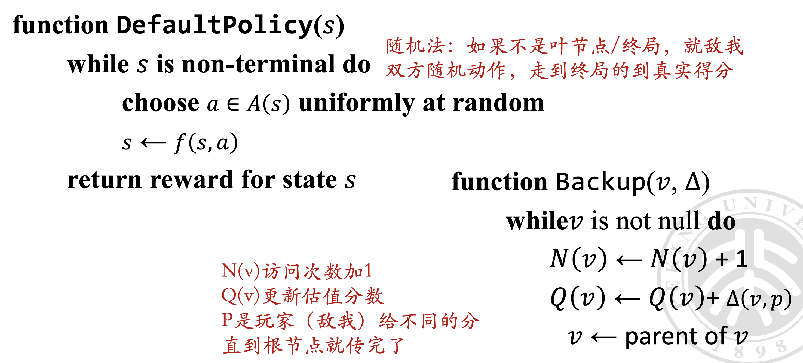

# 对抗搜索

<center>
  by <a href="https://github.com/zhuozhiyongde">Arthals</a> / GPT4 / Claude 3 Opus
  <br/>
  blog: <a href="https://arthals.ink">Arthals' ink</a>
</center>

## 问题模型

### 对抗性

在零和游戏中，总收益为零，**一方的收益必然是另一方的损失**。常见于竞争性环境，如内卷现象。

非零和游戏中，总收益不为零，各方通过最大化自身利益，**有时还需要合作**。损人不一定利己，可以多方共同从第三方获取收益。

### 人数分类

-   单人游戏：仅一个参与者
-   双人游戏：两个参与者
-   多人游戏：三个及以上参与者

### 随机性

-   确定性游戏：动作引发的后果是确定的
-   非确定性游戏：动作引发的后果是不确定的

### 状态可见性

-   完全信息游戏：所有信息对所有玩家都是已知的
-   非完全信息游戏：对玩家存在未知信息

### 同步性

-   同步游戏：所有玩家同时进行决策
-   异步游戏：玩家依次进行决策

### 环境的可变性

-   环境信息不变游戏：游戏环境信息保持不变
-   环境信息变化游戏：游戏环境信息会发生变化

## 双人零和游戏

### 游戏定义

一个双人零和游戏可以定义为一个 **搜索** 问题，包含以下元素：

-   `S0`：初始状态，描述游戏开始时的状态。
-   `PLAYER(s)`：在某个局面下，轮到哪个玩家选择动作。
-   `ACTIONS(s)`：返回在某个状态下的合法动作集合。
-   `RESULT(s,a)`：状态转移模型，一个动作执行后到达哪个状态。
-   `TERMINAL-TEST(s)`：游戏结束返回 `true`，否则返回 `false`。游戏结束时的状态称为终止状态。
-   `UTILITY(s, p)`：效用函数（目标函数或者支付函数），表示游戏结束时玩家 $p$ 的得分。零和游戏中，所有玩家得分的和为零。

### 搜索树复杂性

游戏的难点在于 **搜索树可能非常大**。

-   国际象棋
    -   平均每步有 35 个选择。
    -   每个选手需要走 50 步，两人总共 100 步。
    -   搜索树节点数：$35^{100}$ 或 $10^{154}$ 个节点。
-   围棋
    -   平均每步有 250 个选择。
    -   每个选手需要走 150 步，两人总共 300 步。
    -   搜索树节点数：$250^{300}$ 或 $10^{720}$ 个节点。

过往的搜索算法无法遍历和存储如此大的搜索树，这使得问题变得非常困难。

然而，即使无法计算最优动作，游戏依然需要做出某种决策。为此，我们需要进一步优化搜索过程。

## 极大极小搜索 MINIMAX

MINIMAX 方法遍历所有可能发生的局面，找出最佳方案。其假设 **对手和自己一样聪明**，对手总是 **最小化** 你的收益，而你则 **最大化** 自己的收益。你采取的方案是 **相对稳妥** 的方案。

这就是极大极小（Minimax）搜索的雏形，其基本思路如下：

-   **状态**：局面
-   **动作**：在该局面下，该走棋的玩家的合法动作
-   **状态转移**：一步过后的所有可能局面
-   **极大极小搜索**：在决策树上的游历，假设敌人和自己一样聪明



> 这张图中，各个层的选值都是选择下面的分支的，然后传递到上面的分支

### 伪代码


可以通过合并符号来简化伪代码，得到一个类似于如下的序列：

$$
-1,1,-1,1,-1,1,-1,1,\ldots
$$


其中核心一句在 `v ← max(v, -GetValue(y))`，这句 `-GetValue(y)` 中的负号会不断地颠倒 `max` 操作的实际上取方向，从而使得一个一直上取的 `GetValue` 函数等价于原先的交替上下取的版本。

若依据此写法，则实际上并没显性的 Max 节点和 Min 节点的区分了。而是仅仅根据从根节点迭代到当前节点，一共乘了几次负号来判断（不包含当前节点的 `v ← max(v, -GetValue(y))` 中的负号）：

-   如果乘的是偶数次负号，则是 Max 节点
-   如果乘的是奇数次负号，则是 Min 节点

极大极小搜索算法采用 **深度优先搜索算法** （递归调用 `GetValue` 函数直至抵达代表终止状态的叶节点，意味着深度优先）。假设搜索树的深度是 $m$，每个结点有 $b$ 个合法操作，则极大极小算法的时间复杂度是 $O(b^m)$​。空间复杂度如下：

-   展开所有儿子结点：$O(b^m)$
-   只展开一个儿子：$O(m)$

这意味着在真实的复杂对弈中，此模型并不实用。

## 记忆与估值

1956 年，IBM 的 Arthur Samuel 制作了西洋跳棋 AI，能够轻松打败新手玩家。该 AI 基于极大极小搜索，并增加了 **学习能力**，包括：

-   **死记硬背学习**：直接使用之前极大极小搜索的计算结果对每步进行估值。
-   **一般化学习**：通过 **参数化** 的估值函数，不断调整参数以缩小计算 **估值** 和实际评价的差距。

这种学习方法带来了 AI 水平的突破性进展（不同于类似全局估值表这样的字典，一般化学习实际上使用了更少的参数来表示估值函数，大大提高了同硬件水平下的性能）。深蓝和 AlphaGo 都是上述第二种算法的演化版本，利用参数化模型预测真实估值。

> 这里的估值，可以理解为先前神经网络中，你训练得到的推理结果。
>
> 缩小估值与实际评价的差距，就是类似于之前不断反向传播从而减小损失函数，提高神经网络性能。

## Alpha-Beta 剪枝算法

Alpha-Beta 剪枝算法在搜索时返回与极大极小搜索相同的结果，但 **忽略** 了搜索树上那些不会影响最终结果的部分。可以认为，Alpha-Beta 剪枝算法是极大极小搜索算法的简化版本。

剪枝：是指在搜索树中去掉一些分支，以减少计算量。这里的剪枝是 **无损失** 的，不会影响最终结果。

### 伪代码

$$
\begin{array}{l}
\textbf{function} \ \text{ALPHA-BETA-SEARCH}(state) \ \textbf{returns} \ \text{an action} \\
\quad v \leftarrow \text{MAX-VALUE}(state, -\infty, +\infty) \\
\quad \textbf{return} \ \text{the action in} \ \text{ACTIONS}(state) \ \text{with value} \ v
\end{array}
$$

-   **初始条件**：最大下界 $\alpha$ 设置为 $-\infin$，最小上界 $\beta$ 设置为 $+\infin$。
-   这个函数是搜索的入口。它接受当前的状态节点 `state`，并调用 `MAX-VALUE` 函数开始搜索
-   由于我们要最大化自己的效益函数，所以通过 `MAX-VALUE` 函数来遍历当前节点的子节点（以及更多的后继节点），`MAX-VALUE` 函数返回的是一个价值 $v$，我们根据这个 $v$​ 找到对应的动作 `action`。

$$
\begin{array}{l}
\textbf{function} \ \text{MAX-VALUE}(state, \alpha, \beta) \ \textbf{returns} \ \text{a utility value} \\
\quad \textbf{if} \ \text{TERMINAL-TEST}(state) \ \textbf{then return} \ \text{UTILITY}(state) \\
\quad v \leftarrow -\infty \\
\quad \textbf{for each} \ a \ \textbf{in} \ \text{ACTIONS}(state) \ \textbf{do} \\
\quad \quad v \leftarrow \max(v, \text{MIN-VALUE}(\text{RESULT}(s, a), \alpha, \beta)) \\
\quad \quad \textbf{if} \ v \geq \beta \ \textbf{then return} \ v \\
\quad \quad \alpha \leftarrow \max(\alpha, v) \\
\quad \textbf{return} \ v \\
\end{array}
$$

-   **传入参数**：当前状态 `state`，当前状态的最大下界 $\alpha$，当前状态的最小上界 $\beta$。

-   **初始条件**：如果当前状态是终止状态（`TERMINAL-TEST(state)`），直接返回状态的效用值 `UTILITY(state)`。

-   **初始化**：将 $v$ 初始化为 $-\infin$，因为我们现在是在 Max 层，所以我们的目标是不断的 **最大化下界** 以提高我们的效用函数的输出，这对应了后续的更新 $\alpha$ 的操作。

-   **遍历动作**：对每个可能的动作 `a`，计算该动作结果状态的价值。这个结果状态通过 `MIN-VALUE` 函数评估。注意，与 `MAX-VALUE` 函数相对，`MIN-VALUE` 函数代表对手，其目标是不断地 **最小化上界** 以削弱我们效益函数的输出，`MIN-VALUE` 返回的是下一层能拿到的 **最小上界**。在这个循环遍历的过程中，我们会不断的更新 $v$，它指示本层可能拿到的 **最大值**。

-   **剪枝条件**：如果当前状态可能拿到的最大值 $v$ 的值已经累进到大于或等于传入的当前最小上界 $\beta$，则可以停止继续评估剩下的动作，直接返回 $v$。这是因为当前层是一个 `MAX-VALUE` 层，我们返回的状态价值必然大于等于 $v$ ，当前层的上一层（若有）又是一个 `MIN-VALUE` 层，它不可能在已知有更小可能的 $\beta$ 下选择当前节点的返回值。所以本节点于更新上层状态节点的估值完全无益了，提前返回可以实现剪枝，避免多余的计算。

    

    > 极小值冗余如图所示，这是一颗博弈树的某一部分，节点 B 的值为 10（$\beta=10$），节点 D 的值为 19，这里，C 节点为取最大值 max 节点。
    >
    > 因此，C 的值将大于等于 19（$v \geq 19 \geq \beta$）；
    >
    > 节点 A 为取极小值的 min 节点（这就是 $v \geq \beta$ 推知剪枝的根本原因），
    >
    > 因此 A 的值只能取 B 的值 10，也就是说不再需要求节点 C 的子节点 E 和 F 的值就可以得出节点 A 的值。
    >
    > 这样将节点 D 的后继兄弟节点减去称为 Beta 剪枝。[^1]

-   更新 $\alpha$：如果上述剪枝条件没有满足，那么意味着我们找到了一个更大的 $v$，我们更新当前的最大下界 $\alpha$，即 $\alpha \leftarrow \max(\alpha, v)$。

    要注意在整个过程中 $\alpha,\beta$ 的作用域，$\beta$ 一直不变，$\alpha$ 在动作迭代间改变，方便 `Min-Value` 函数用于剪枝。

-   最后，返回 $v$​​，它代表本节点能够获得的最大效益。

**这里建议参照 [OI Wiki / Alpha-Beta 剪枝](https://oi-wiki.org/search/alpha-beta/) 的具体图例理解。**

$$
\begin{array}{l}
\textbf{function} \ \text{MIN-VALUE}(state, \alpha, \beta) \ \textbf{returns} \ \text{a utility value} \\
\quad \textbf{if} \ \text{TERMINAL-TEST}(state) \ \textbf{then return} \ \text{UTILITY}(state) \\
\quad v \leftarrow +\infty \\
\quad \textbf{for each} \ a \ \textbf{in} \ \text{ACTIONS}(state) \ \textbf{do} \\
\quad \quad v \leftarrow \min(v, \text{MAX-VALUE}(\text{RESULT}(s, a), \alpha, \beta)) \\
\quad \quad \textbf{if} \ v \leq \alpha \ \textbf{then return} \ v \\
\quad \quad \beta \leftarrow \min(\beta, v) \\
\quad \textbf{return} \ v \\
\end{array}
$$

-   分析类似上面 `MAX-VALUE` 的情形。

-   剪枝条件：

    

    > 极大值冗余如图所示，这也是一颗博弈树的某一部分，节点下的数据为该节点的值，节点 B 的值为 20（$\alpha = 20$），节点 D 的值为 15，这里，C 为取极小值的 min 节点。
    >
    > 因此节点 C 的值将小于等于 15 （$v \leq 15 \leq \alpha$​）；
    >
    > 节点 A 为取最大值 max 的节点（这就是 $v \leq \alpha$ 推知剪枝的根本原因），因此 A 只可能取到 B 的值，也是就说不再需要搜索 C 的其他子节点 E 和 F 的值就可以得出节点 A 的值。
    >
    > 这样将节点 D 的后继兄弟节点减去称为 Alpha 剪枝。[^1]

### 剪枝条件总结 [^1]

-   当一个 Min 节点的 $v$ 值 ≤ 任何一个祖先节点的最大上界 $α$ 时 ，剪掉该节点及其所有子节点
-   当一个 Max 节点的 $v$ 值 ≥ 任何一个祖先节点的最小上界 $β$ 时 ，剪掉该节点及其所有子节点

### 二合一伪代码

$$
\begin{array}{l}
\textbf{function} \ \text{GET-VALUE}(node, \alpha, \beta) \\
\quad \textbf{if} \ node \ \text{is a Leaf node} \ \textbf{then} \\
\quad \quad \textbf{return} \ \text{the result of the game} \\
\quad \textbf{end if} \\
\quad v \leftarrow -\infty \\
\quad \textbf{for each} \ y \ \in \ \text{Subnodes}(node) \ \textbf{do} \\
\quad \quad v \leftarrow \max(v, -\text{GET-VALUE}(y, -\beta, -\max(\alpha, v))) \\
\quad \quad \textbf{if} \ v > \beta \ \textbf{then} \\
\quad \quad \quad \textbf{return} \ v \\
\quad \quad \textbf{end if} \\
\quad \textbf{end for} \\
\quad \textbf{return} \ v \\
\textbf{end function} \\
\end{array}
$$

同样是仿照先前的思路，我们依旧是通过不断的变号、颠倒上下界来完成合并。

注意，在这个过程中 $\alpha$ 实际上不会改变。这对应了无论是在 `Max-Value` 还是在 `Min-Value` 中，实际上都有一侧的界没有更新：

-   在 `Max-Value` 中，我们不断的更新最大下界 $\alpha$，而最小上界 $\beta$ 一直是不变的。
-   在 `Min-Value` 中，我们不断的更新最小上界 $\beta$，而最大下界 $\alpha$ 一直是不变的。

### 复杂度分析

#### 最好情况

1. 节点展开情况：

    - 第一层：每个节点生出 $b$ 个儿子
    - 第二层：每个节点生出 1 个儿子，其他节点全都在此节点获得到界值后被剪枝
    - 第三层：每个节点生出 $b$ 个儿子，这对应上一层中第 1 个儿子获得界值的过程
    - 依次类推，一层 $b$、一层 1、一层 $b$...

    

2. 层数关系：假设树的最大深度为 $m$，则有 $b$ 的层数为 $m/2$

在最好的情况下，我们只需检查 $O(b^{m/2})$ 个节点即可找到最优解。这比 Minimax 算法的 $O(b^m)$ 复杂度要好得多。具体来说：

-   每个状态平均有 $\sqrt{b}$ 个选择，而不是 $b$ 个选择
-   从另一个角度看，Alpha-Beta 算法可以在相同时间内比 Minimax 算法搜索更深一倍的节点

#### 最差情况

在最差情况下，Alpha-beta 剪枝算法并不能减少任何节点的评估数量。这种情况发生在节点按照最差顺序进行搜索时，即每次都先访问最不优的节点，导致完全没有任何剪枝发生。其时间复杂度与 Minimax 算法相同，同为：$O(b^m)$

#### 平均情况

在平均情况下，Alpha-beta 剪枝算法的时间复杂度介于最优情况和最差情况之间。一般情况下，平均时间复杂度近似为 $O(b^{3m/4})$

## 不完美的实时决策

-   传统方法：Minimax 或 Alpha-beta 算法都需要直接搜索到终局状态（叶子节点），计算准确的胜负，这对于搜索树很深的情况并不好。
-   改进方法：用启发式函数 `EVAL` 在非叶子节点 **进行估值，从而提前截断搜索**。也即，在没有搜索到终局状态时，若满足一定条件（`Cutoff Test`），提前使用 `EVAL` 给出一个返回值，从而避免一直要（深度）搜索到叶子节点（即满足 `Terminal Test`）才能使用真实效用函数 `UTILITY`，加快计算效率。

### 状态估值函数的特性

-   **终局状态估值函数和真实得分的一致性**：在游戏的终局状态，状态估值函数必须给出与真实得分一致的值。这意味着当游戏结束时，估值函数应该准确反映当前局面的得分情况。也即，此时必须有 `EVAL == UTILITY`
-   **计算效率**：估值函数的计算不能花费太多时间。
-   **强相关性**：非终局条件下，估值函数在非终局状态下要与最终胜负有很 **强的正相关性**。

### 状态估值函数的设计

一个很自然的想法是，设计各种特征，并对特征进行线性加权，从而获得一个状态估值函数：

$$
\mathrm{EVAL}(s)=w_1 f_1(s)+w_2 f_2(s)+\cdots+w_n f_n(s)=\sum_{i=1}^n w_i f_i(s)
$$

但是，采用线性加权函数作为状态估值函数的效果并不好，因为他假设每个特征的贡献是 **独立** 的，以及是可以线性估值的，但是在真实情况中，这都是不一定的：

-   不同的特征之间可能有复杂的相互影响，导致非独立性
-   估值函数可能不是平滑线性变化的

而且，手工设计特征和特征权重，实际上是基于人为提供的 **先验经验** 的，且不说其是否准确可用，对于一些游戏，甚至不一定有。

因而，我们可以采用先前的机器学习方法来学到一个的 **非线性** 的复杂估值函数，从而拟合真实情况。

### 状态估值函数的应用

当我们有了状态估值函数后，我们就可以用 cutoff test 替代 terminal test，提前返回估值函数 `eval` 的值来加快搜索。

```c
// before
if TERMINAL-TEST(state) then return UTILITY(state)
// after
if CUTOFF-TEST(state, depth) then return EVAL(state)
```

-   在搜索深度达到搜索深度限制 $d$ 时，调用 `eval` 函数返回估值。
-   如果不好确定深度，可以使用 **迭代加深** 方法。当深度限制到了，算法返回搜索到的最深一层所返回的值。若深度限制到了但没找到终局，就让深度限制大一点，继续搜索。
-   估值函数还可以用来对子结点排序，好的节点排在前面，可以提升 Alpha-Beta 剪枝的效率。

$$
\text{H-Minimax}(s, d) =\\
\begin{cases}
\text{Eval}(s) & \text{if } \text{Cutoff-Test}(s, d) \\
\max_{a \in \text{Actions}(s)} \text{H-Minimax}(\text{Result}(s, a), d + 1) & \text{if Player}(s) = \text{MAX} \\
\min_{a \in \text{Actions}(s)} \text{H-Minimax}(\text{Result}(s, a), d + 1) & \text{if Player}(s) = \text{MIN}
\end{cases}
$$

### 小结

实时决策：指在规定时间内给出决策结果。例如下棋时，需要在走子时限内做出决策。

不完美的实施决策：问题规模很大的时候，受限于时间限制，我们 **无法搜索到终局**，也就无从准确的胜负情况，因此决策是不完美的。

解决方法：

1. 使用 **启发式状态估值函数** 来估计当前状态的价值
2. 限定搜索深度，到了一定深度就截断搜索
3. 难以确定搜索深度，则可以采用迭代加深的方法。在时间允许范围内逐步加深搜索深度，直到到达时限

状态估值函数：

1. 可以采用经验定义，或者机器学习的方法
2. 搜到终局的时候必须采用真的得分，否则返回估计值
3. 状态估值函数影响决策好坏
4. 可用于 **子节点排序**，提升 Alpha-Beta 剪枝的效率

## 蒙特卡洛树搜索

蒙特卡洛方法（Monte Carlo method）是一种 **统计模拟** 方法，通过大量采样来获得概率估计。这种方法依赖于概率论中的大数定律，即大量重复实验的平均结果将接近于某个确定值。其 **不是** 一个严格意义上的算法。

大数定律：

$$
\lim_{n \to \infty} \frac{1}{n} \sum_{i=1}^{n} X_i = E(X)
$$

特点：**统计方法**，计算能力越强，性能越好。

优点：即使在没有领域知识的情况下也能使用。因为它绕过了人为设定好的状态估值函数这一困难很大的步骤，而是基于大量的随机采样来估计状态的价值。

### 纯随机蒙特卡洛方法

先前的决策方法依赖于状态估值函数的设计，但是很难设计一个好的状态估值函数。

所以，我们可以直接进行对弈模拟（双方策略都是随机下），即在决策空间中随机采样，根据采样的结果来评估状态价值（如计算平均胜率），然后据此来排序子节点。

纯随机蒙特卡洛方法正是采用了上述模拟思想，运用 **随机搜索** 策略，通过大量随机模拟来估计当前状态的价值。

通过这种方式，纯随机蒙特卡洛方法能够有效地在复杂搜索空间中找到较优解，而无需人为设计的状态估值函数。

#### 算法过程



1. **节点选择**：在当前节点下，存在 N 个可能的后继儿子节点。
2. **估值计算**：
    - 对每个儿子节点进行 M 次随机搜索。
    - 每次搜索中，敌我双方均采用随机动作，直至终局。
    - 通过 M 次搜索的结果，计算每个儿子节点的平均胜率。
3. **决策**：选择胜率最高的儿子节点作为下一步的行动。

#### 缺点

-   **内存利用不足**：该方法未充分利用内存资源。
-   **准确性问题**：除非 M（搜索次数）非常大，否则估值可能不够准确。
-   **重复搜索**：该方法可能导致大量重复状态的搜索，影响效率。

### 蒙特卡洛树搜索

蒙特卡洛树搜索（Monte Carlo Tree Search，MCTS）也是一种通过在决策空间中（模拟）随机采样，并根据结果 **构建搜索树** 来在给定域中寻找最优决策的方法。

与前文纯随机的蒙特卡洛算法不同，MCTS 结合了 **树搜索**，能够 **记住之前的模拟结果**，并利用这些信息来指导未来的搜索，从而避免无效的重复搜索并专注于更有前景的分支。

换句话说，他不会在一条分支下无限下探，在对一条分支的搜索中，他会不断地更新这条分支的价值，一旦其他分支的价值更高，它会转向搜索其他分支。

而纯随机的蒙特卡洛算法直接就没有搜索树的概念，它就是直接暴力模拟所有可选动作，然后选择胜率最好的那个。



#### 算法过程

1. **选择（Selection）**：从 **根节点** 开始，使用子节点 **树策略** 递归向下选择节点，直到找到一个非终止且未访问的子节点。
2. **扩张（Expansion）**：根据可选择的动作，添加一个或多个子节点来展开树。
3. **模拟（Simulation）**：从被选择的节点开始，使用 **默认策略** 进行动作选择和状态转换，直到达到终止状态。蒙特卡洛搜索树会根据模拟结果进行更新。
4. **反向传播（Backup）**：更新与被选择节点及其祖先节点相关的统计信息。

#### 树策略（Tree Policy）与默认策略（Default Policy）

**树策略** 是蒙特卡洛树搜索（MCTS）中用于 **选择下一个要模拟的节点** 的策略，其核心在于平衡探索（Exploration）和利用（Exploitation）：

-   **探索**：旨在检查尚未充分了解的区域，以发现新的可能性。
-   **利用**：侧重于使用已知且预期效果最佳的区域，以优化当前的选择。

这种平衡确保了搜索过程既能发现新的策略，又能有效利用已知信息。

> 树策略不一定是完全只看模拟胜率的贪心！

**树策略**：负责在蒙特卡洛树搜索（MCTS）的 **选择和扩张** 阶段，从现有的搜索树中选择节点并创建新的叶节点。这一过程是基于当前树的状态和可能的未来收益来决定路径的。

**默认策略**：在 **模拟阶段** 发挥作用，它从一个非终止状态开始，通过不断模拟游戏直至结束，从而得到一个价值评估。这个评估帮助 MCTS 确定哪些路径可能更有价值。**默认策略是对原先状态估值函数的替换。**

### UCT 算法

UCT（Upper Confidence Bound for Trees）算法是一种蒙特卡洛树搜索（MCTS）的变种，它使用 **置信上界** 来平衡探索和利用。UCT 算法的核心思想是 **在选择节点时，优先选择置信上界最高的节点**。



可以看到，这里实际上有时间 / 步数限制的，实际上搜索得越久、估值越准。


可以发现，如果一个节点是非终止状态，那么：

1. 如果存在未访问过的子节点，那么优先展开未访问过的子节点
2. 如果子节点都探索过了，使用 `BestChild` 算法来获得一个子节点，移动到这个子节点，然后继续递归循环

循环终止的条件是下列之一：

1. 找到一个完全未探索的子节点
2. 当前节点是终止状态

注意到循环条件中，1 比较容易满足，而 2 对于对局很深的游戏几乎不可能满足，所以说实际运算时，**其实无法将整棵搜索树完整地构建出来**。只需建出访问过的节点所构成的这部分搜索树，并在需要访问子节点时 **计算出应该访问哪一个就行** （先用几次 `BestChild` 然后根据 1 返回一个未被展开过的节点，继续探索）



对于终止状态，采用默认策略来进行模拟，然后进行反向传播更新搜索树。

#### UCB 公式

UCB 公式是用于在 MCTS 中选择最佳子节点的，即 `BestChild` 函数中的计算方法。UCB 的目的是在探索和利用之间找到平衡。

其可以表示为：

$$
\text{UCB} = \frac{Q(v')}{N(v')} + c \sqrt{\frac{2 \ln N(v)}{N(v')}}
$$

$\frac{Q(v')}{N(v')}$ 代表 **利用（exploitation）**，即节点 $v'$ 的平均价值，其中 $Q(v')$ 是节点 $v'$ 的总价值（例如，获胜的次数），$N(v')$ 是节点 $v'$ 被访问的次数。这一项反映了节点 $v'$ 当前的表现，**鼓励算法利用已知的好走法**。

$c \sqrt{\frac{2 \ln N(v)}{N(v')}}$ 代表 **探索（exploration）**，其中 $c$ 是探索参数，$N(v)$ 是父节点 $v$ 的访问次数。这一项 **鼓励算法探索那些访问次数较少的节点**。

在 `BestChild` 函数中，算法会遍历所有子节点 $v'$​​，计算每个节点的 UCB 值，并选择 UCB 值最大的节点作为最佳子节点。这样，算法就能在已知的好走法和潜在的未知走法之间进行权衡，从而有效地进行树的搜索。

## 参考

[ouuan / 蒙特卡洛树搜索（MCTS）学习笔记](https://ouuan.github.io/post/monte-carlo-tree-search/)：强推，讲的 MCTS 应该比我这篇好。

[^1]: https://www.cnblogs.com/devilmaycry812839668/p/15782087.html
